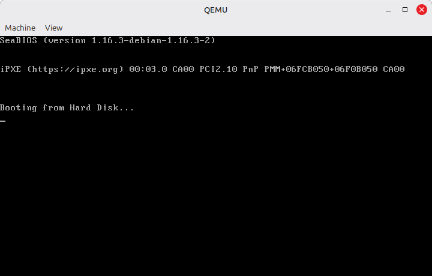
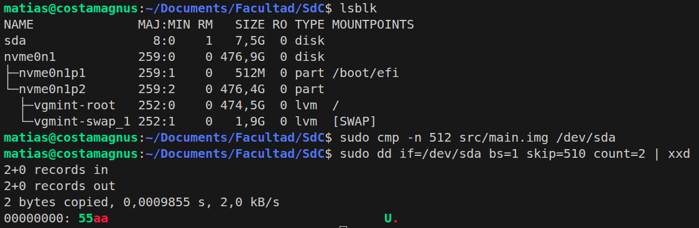

# Modo Protegido

**Asignatura:** Sistemas de Computación  

**Profesores:** 
  - Jorge, Javier Alejandro
  - Solinas, Miguel Angel

**Estudiantes:** 
  - Costamagna, Matias
  - Davila Tomassi, Carlos Valentino
  - Sabena, Maria Pilar

**Link del repositorio:** https://github.com/Mati-Costamagna/sudo-apruebenos/tree/TP3

**Fecha:** Abril 2026

---

## 1. Introduccion

Los procesadores x86 mantienen compatibilidad con sus antecesores mediante un proceso de evolucion durante el arranque. Al energizarse, todo CPU x86 comienza en modo real para garantizar compatibilidad hacia atras con el 8086 original, operando en 16 bits con acceso directo a solo 1 MB de memoria fisica y sin ningun mecanismo de proteccion entre procesos.

El problema fundamental del modo real es que cualquier programa puede leer o escribir cualquier direccion de memoria, incluyendo la del propio sistema operativo. Esto hace imposible construir un sistema multitarea estable: un solo proceso con un bug puede corromper todo el sistema. El modo real era aceptable cuando una computadora ejecutaba un solo programa a la vez, pero se volvio insostenible con el avance del software.

El modo protegido resuelve exactamente ese problema. Introducido con el 80286, fue el primer intento de agregar hardware especifico para aislar procesos entre sí y del sistema operativo. Sin embargo, la implementacion del 286 era incompleta: una vez en modo protegido, no habia forma de volver a modo real sin resetear el procesador, lo que lo hizo poco practico. Fue el 80386 quien consolido el modelo que usamos hasta hoy, agregando paginacion, modos de 32 bits completos y la posibilidad de retornar a modo real mediante software.

Sus características principales son:

- Proteccion de memoria: los programas no pueden acceder a zonas de memoria que no les corresponden. El hardware verifica cada acceso.
- Memoria virtual: soporte por hardware para memoria que excede la RAM fisica, mediante paginacion.
- Multitarea: conmutacion de tareas gestionada por hardware con contextos separados.
- Niveles de privilegio (rings): separacion entre codigo del kernel y codigo de usuario, con el hardware actuando como arbitro.

El objetivo de este TP es comprender y ejecutar la transicion desde modo real a modo protegido en un procesador x86, utilizando QEMU como entorno de virtualizacion.

---

## 2. Entorno de Trabajo

### 2.1 Herramientas utilizadas

```bash
sudo apt install qemu-system-x86 nasm binutils gdb
```

### 2.2 Sintaxis AT&T vs Intel (GAS vs NASM)

Existen dos ensambladores predominantes para x86: **NASM** (que usa sintaxis Intel) y **GAS** (que usa sintaxis AT&T, tambien llamada sintaxis Unix). Ambos generan el mismo codigo maquina, pero con convenciones opuestas. Conocer las diferencias es esencial porque la mayoria de ejemplos de bootloaders y kernels mezclan ambas tradiciones.
 
| Caracteristica | Intel (NASM) | AT&T (GAS) |
|---|---|---|
| Orden operandos | `mov dst, src` | `mov src, dst` |
| Inmediatos | `push 4` | `pushl $4` |
| Registros | `eax` | `%eax` |
| Tamaño de operando | prefijo en memoria (`byte ptr`) | sufijo en opcode (`movb`, `movw`, `movl`) |
| Comentarios | `;` | `#` o `/* */` |
 
La diferencia mas critica en la practica es el orden de operandos: en Intel el destino va primero, en AT&T va ultimo. Leer codigo AT&T con la intuicion de Intel (o viceversa) lleva a interpretar exactamente al reves que registro se esta modificando.

**Ejemplos comparativos:**

```asm
; Intel / NASM
mov eax, 4          ; EAX ← 4
mov al, byte ptr foo
push 4
 
# AT&T / GAS
movl $4, %eax       # EAX ← 4
movb foo, %al
pushl $4
```

### 2.3 Imagen booteable MBR

En arquitectura x86 lo mas simple es crear un sector de arranque MBR (Master Boot Record). El MBR ocupa exactamente 512 bytes y termina obligatoriamente con la firma `0x55 0xAA`.
 
```bash
printf '\364%509s\125\252' > src/main.img
```
 
Desglose del comando:
 
- `\364` (octal) = `0xF4` (hex) = instruccion `hlt` (detener CPU)
- `%509s` = 509 espacios para completar hasta el byte 510
- `\125\252` (octal) = `0x55 0xAA` = firma de sector booteable
Esta firma es lo **unico** que la BIOS verifica antes de ejecutar el contenido del sector. No hay ninguna validacion del codigo en si: si los ultimos dos bytes son `0x55 0xAA`, la BIOS transfiere el control incondicionalmente a `0x7C00`. Esto explica por que un sector completamente vacio excepto por esos dos bytes es tecnicamente "booteable", y también por que el malware de bootkit puede sobrevivir a una reinstalacion del sistema operativo: infecta el MBR antes de que cualquier software de seguridad del OS este activo.
 
**Estructura del MBR clasico:**
 
| Direccion (hex) | Tamaño (bytes) | Descripcion |
|---|---|---|
| 0x000 | 446 | Bootstrap code area |
| 0x1BE | 16 | Partition entry #1 |
| 0x1CE | 16 | Partition entry #2 |
| 0x1DE | 16 | Partition entry #3 |
| 0x1EE | 16 | Partition entry #4 |
| 0x1FE | 2 | Boot signature (0x55 0xAA) |
 
Para verificar el contenido de la imagen:
 
```bash
hd src/main.img
```
 
Para obtener la codificacion hexadecimal de una instrucción:
 
```bash
echo hlt > src/a.S
as -o src/a.o src/a.S
objdump -S src/a.o
```

### 2.4 Ejecucion de la imagen con QEMU

```bash
sudo apt install qemu-system-x86
qemu-system-x86_64 --drive file=src/main.img,format=raw,index=0,media=disk
```



### 2.5 Grabado en hardware real y problema con UEFI

Se intento grabar la imagen en un pendrive y bootear desde hardware real siguiendo el procedimiento estandar:

```bash
sudo dd if=src/main.img of=/dev/sda
```


Para verificar que la imagen fue grabada correctamente se ejecutaron los siguientes comandos:

```bash
# Verificar que el pendrive fue reconocido por el sistema
lsblk

# Comparar byte a byte la imagen con el dispositivo
sudo cmp -n 512 src/main.img /dev/sda

# Verificar la firma 0x55 0xAA en los bytes 510-511 del dispositivo
sudo dd if=/dev/sda bs=1 skip=510 count=2 | xxd
```


La verificacion confirmo que la imagen fue grabada correctamente: los primeros 512 bytes del pendrive eran identicos a main.img y la firma 0x55 0xAA estaba presente en los offsets 0x1FE–0x1FF.
Sin embargo, al intentar bootear desde el pendrive, la UEFI de la maquina no detecto el dispositivo como booteable.

Luego de invesigar (un laaargo rato), encontramos que la razon es conceptual y no un error del procedimiento: una imagen MBR con bootloader de 16 bits no es reconocida como dispositivo booteable por UEFI.
El estandar UEFI espera una estructura completamente distinta, pero mas adelante se abordara este tema.