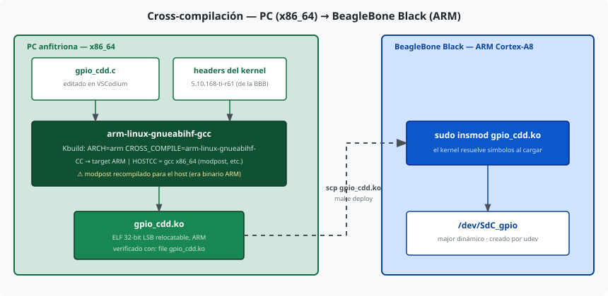
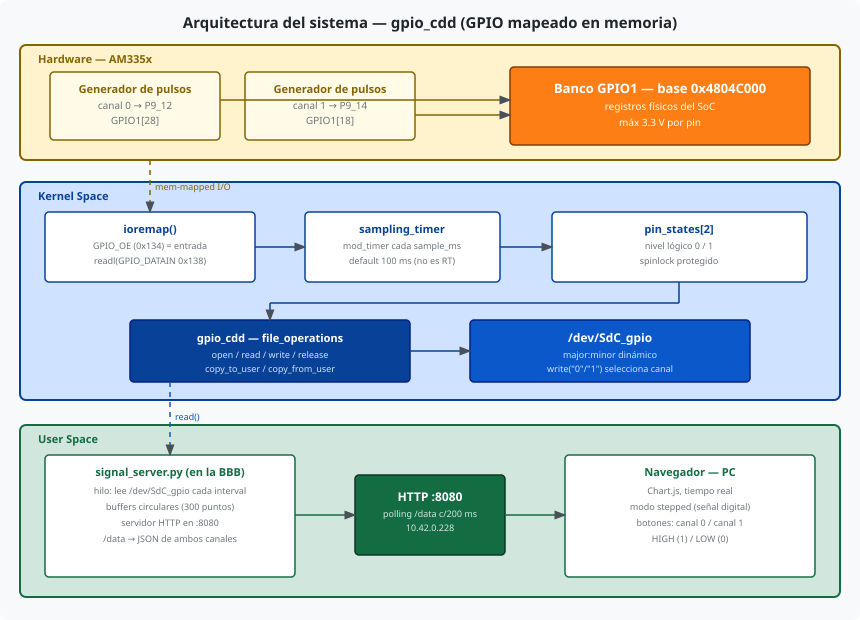
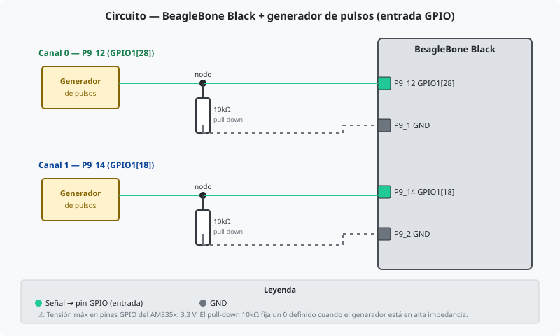
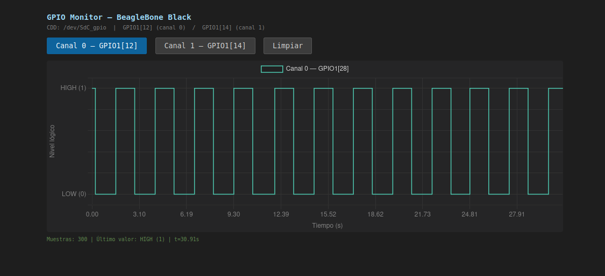
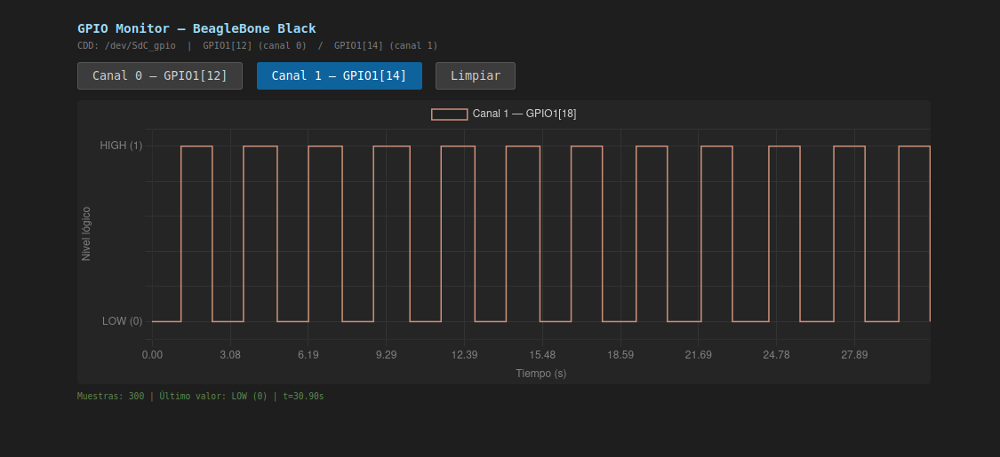

# Device Drivers — Construcción de un CDD sobre BeagleBone Black

**Asignatura:** Sistemas de Computación

**Profesores:**
  - Jorge, Javier Alejandro
  - Solinas, Miguel Angel

**Estudiantes:**
  - Costamagna, Matias
  - Davila Tomassi, Carlos Valentino
  - Sabena, Maria Pilar

**Link del repositorio:** https://github.com/Mati-Costamagna/sudo-apruebenos/tree/TP5

**Fecha:** Junio 2026

---

## De qué trata este informe

Este trabajo cuenta el recorrido de construir un **Character Device Driver (CDD)** desde cero sobre una **BeagleBone Black (BBB)** y conectarlo con aplicaciones de espacio de usuario. No fue un único intento sino una progresión: arrancamos leyendo señales analógicas con el **ADC integrado** a través del subsistema IIO, y luego —buscando un acceso más cercano al hardware y un flujo de trabajo distinto— migramos a leer **pines GPIO mapeados en memoria** con cross-compilación.

El informe sigue ese mismo orden cronológico. Primero los fundamentos comunes a cualquier CDD; después las dos etapas de implementación con su motivación, sus problemas y sus correcciones; y al final el experimento que mejor resume lo aprendido sobre los límites del muestreo por software en un Linux no-RT.

| | **Etapa 1 — ADC/IIO** (`sdec_cdd`) | **Etapa 2 — GPIO** (`gpio_cdd`) |
|---|---|---|
| Fuente de la señal | ADC integrado vía subsistema IIO (sysfs) | GPIO mapeado en memoria (registros AM335x) |
| Compilación | Nativa en la BBB | Cross-compilación desde la PC |
| Aplicación | matplotlib sobre SSH | Servidor web + Chart.js sobre HTTP |
| Hardware de prueba | LM35 (temperatura) + LDR (luz) | Generadores de pulsos en P9_12 / P9_14 |

---

## Introducción

Un "driver" es aquel que conduce, administra y controla la entidad bajo su mando. En el contexto del software de sistemas, un **device driver** hace exactamente eso con un dispositivo: proporciona una abstracción del hardware y una interfaz, posiblemente estandarizada, para que el sistema operativo y las aplicaciones de usuario puedan interactuar con él sin conocer los detalles de su funcionamiento interno.

Es importante distinguir tres conceptos:

- **Device driver (software driver):** pieza de software que controla un dispositivo a través del sistema operativo. Es el foco de este trabajo.
- **Device controller:** dispositivo de hardware que gestiona otro dispositivo (ej. un controlador IDE, un controlador USB, un controlador SPI). Es hardware en sí mismo, y generalmente necesita su propio driver (denominado bus driver) para ser gestionado.
- **Bus driver:** driver del bus de comunicación subyacente; es la capa de software más baja del sistema operativo, sobre la cual se construyen los device drivers específicos.

En Linux, los device drivers se clasifican en tres grandes verticales según la naturaleza de su interfaz:

| Vertical | Orientación | Ejemplos |
|---|---|---|
| **Character (CDD)** | Byte a byte, secuencial | Puertos serie, audio, cámaras, GPIO |
| **Block** | Por bloques, acceso aleatorio | Discos, SSDs, particiones |
| **Network** | Por paquetes | Tarjetas de red, Wi-Fi |

El grupo mayoritario de drivers pertenece al vertical **Character**. Todo driver de dispositivo que no sea de almacenamiento ni de red es, en alguna forma, un Character Device Driver (CDD). La interfaz entre el espacio de usuario y el CDD se materializa a través de un **Character Device File (CDF)** en el directorio `/dev`: una aplicación abre ese archivo y realiza operaciones estándar (`open`, `read`, `write`, `close`, `ioctl`) que el Virtual File System (VFS) del kernel redirige a las funciones registradas por el driver.

El vínculo entre el CDF y el CDD no se basa en el nombre del archivo sino en un par de números (major:minor) que el kernel usa como índice. El número mayor identifica al driver responsable; el número menor distingue instancias dentro del mismo driver.

## Objetivos del trabajo

Este trabajo práctico cubre los siguientes temas:

- **Arquitectura de un CDD:** estructura de `file_operations`, registro de major/minor, creación automática del device node vía udev.
- **Ciclo de vida del driver:** `module_init()` / `module_exit()`, `alloc_chrdev_region()`, `class_create()`, `device_create()` y sus contrapartes de cleanup.
- **Transferencia de datos kernel ↔ userspace:** uso correcto de `copy_to_user()` y `copy_from_user()`; por qué no se puede usar `memcpy` directamente.
- **Timers en el kernel:** uso de `timer_list` para ejecutar código periódico en espacio de kernel (muestreo de señales).
- **Sincronización en kernel:** protección de datos compartidos entre el timer callback y las `file_operations` mediante `spinlock`.
- **Dos formas de acceder al hardware:** el subsistema **IIO** para el ADC integrado (etapa 1) y el acceso directo a registros **mapeados en memoria** con `ioremap`/`readl` para los GPIO (etapa 2).
- **procfs:** creación de entradas en `/proc` con `proc_ops` (API recomendada desde kernel 5.6, que reemplaza a `file_operations` para evitar overhead de campos que no aplican en procfs).
- **Compilación nativa vs cross-compilación:** compilar el módulo en la propia BBB frente a compilarlo en la PC apuntando a ARM.
- **Aplicaciones de usuario:** una de escritorio (matplotlib) y una web (Chart.js), cada una con su forma de leer el CDF y graficar en tiempo real.

## Werner Almesberger

Werner Almesberger es un ingeniero de software suizo conocido por sus contribuciones al kernel de Linux, en particular por ser el autor original del soporte para el sistema de archivos **FAT/VFAT** en Linux (módulo `fs/fat`). Su nombre aparece en los comentarios de ese subsistema del kernel. También trabajó en el proyecto LILO (Linux Loader) y fue uno de los primeros contribuidores del kernel en los años 90.

```bash
# Su nombre puede encontrarse en:
ls /lib/modules/$(uname -r)/kernel/fs/fat/
modinfo fat | grep author
```

---

## Fundamentos comunes: de drv1 a clipboard

Antes de tocar hardware real, seguimos la progresión que propone la consigna para construir el esqueleto de un CDD paso a paso. Cada módulo agrega una sola pieza nueva, de modo que cuando llega el momento de leer el ADC o un GPIO, la estructura del driver ya está entendida. Estos módulos no tienen código específico de hardware y se compilan y cargan igual en cualquier Linux.

| Paso | Archivo | Lo que agrega |
|---|---|---|
| 1 | `drv1.c` | `module_init` / `module_exit` — el módulo más mínimo posible |
| 2 | `drv2.c` | `alloc_chrdev_region` — major/minor, nodos manuales con `mknod` |
| 3 | `drv3.c` | `cdev` + `file_operations` + `class`/`device_create` — auto `/dev` vía udev |
| 4 | `drv4.c` | `copy_to_user` / `copy_from_user` — transferencia real de datos |
| 5 | `clipboard.c` | `/proc` con `proc_ops` |

Los dos drivers finales del trabajo (`sdec_cdd` y `gpio_cdd`) son, en esencia, un `drv4` al que se le conecta una fuente de datos de hardware y un `timer_list` que la muestrea.

### El módulo /proc — clipboard

La consigna también pide implementar un módulo que use el sistema de archivos `/proc` en lugar del vertical Character Device. Sirve para contrastar los dos enfoques que ofrece el kernel para exponer información a userspace.

| Aspecto | CDD (`sdec_cdd` / `gpio_cdd`) | procfs (`clipboard`) |
|---|---|---|
| Nodo | `/dev/SdC_cdd`, `/dev/SdC_gpio` | `/proc/clipboard` |
| API de operaciones | `struct file_operations` | `struct proc_ops` |
| Registro | `alloc_chrdev_region` + `cdev_add` | `proc_create` |
| Propósito típico | Dispositivos hardware | Información/configuración del kernel |
| Major:minor | Sí (asignado por kernel) | No aplica |

Desde kernel 5.6, las entradas `/proc` deben usar `proc_ops` en lugar de `file_operations`. Esto evita que el VFS aplique optimizaciones (como `llseek`) que no tienen sentido en archivos virtuales de procfs.

```bash
sudo insmod clipboard.ko
echo "Hola mundo..." > /proc/clipboard   # escribir
cat /proc/clipboard                      # leer → Hola mundo...
sudo rmmod clipboard
```


---

## Dos caminos para alimentar el CDD

Con el esqueleto resuelto, la pregunta interesante pasó a ser **de dónde sacar la señal**. La BBB ofrece (al menos) dos puertas de entrada al mundo físico, y cada una implica decisiones de diseño muy distintas en el driver:

1. **El ADC integrado**, expuesto por el kernel a través del subsistema **IIO**. Es la vía "de alto nivel": el kernel ya tiene un driver para el ADC y nos da los valores listos en sysfs. Fue nuestra primera etapa.
2. **Los pines GPIO**, accedidos **directamente sobre los registros físicos del SoC** con `ioremap`. Es la vía "de bajo nivel": no hay intermediario, el driver lee la memoria del periférico. Fue la segunda etapa, y nos obligó además a montar un flujo de cross-compilación.

Las dos secciones siguientes recorren cada camino tal como lo vivimos.

---

# Etapa 1 — CDD sobre el ADC integrado (`sdec_cdd`)

## Motivación

Queríamos un primer driver que leyera **señales analógicas reales** sin pelear con registros de hardware. El ADC de 12 bits de la BBB (7 canales, máx 1.8 V por pin AIN) ya está manejado por el kernel y expuesto por el subsistema IIO, así que el driver podía concentrarse en lo propio de un CDD —`file_operations`, timer, sincronización, transferencia a userspace— y delegar la conversión analógico-digital al subsistema existente.

## Hardware

| Componente | Cantidad | Función |
|---|---|---|
| BeagleBone Black | 1 | Placa principal (CPU ARM + ADC integrado) |
| Cable mini-USB o Ethernet | 1 | Conexión SSH desde la PC |
| Sensor LM35 | 1 | Sensor de temperatura analógico (Canal 0) |
| LDR | 1 | Sensor de luz (Canal 1) |
| Resistor 10kΩ | 1 | Divisor resistivo para el LDR |
| Breadboard + jumpers | — | Conexiones |


## Arquitectura del driver


### Lectura del ADC vía IIO

El driver utiliza el subsistema **IIO (Industrial I/O)** de Linux, que expone los canales ADC como archivos en sysfs:

```
/sys/bus/iio/devices/iio:device0/in_voltage0_raw  → AIN0 (0–4095)
/sys/bus/iio/devices/iio:device0/in_voltage1_raw  → AIN1 (0–4095)
```

El valor raw se convierte a mV con `mV = raw × 1800 / 4095`. Desde el módulo se accede a esos archivos con `filp_open` + `kernel_read`. La API formal `iio_channel_get()` requiere un `platform_device` y entradas en el Device Tree; al tratarse de un módulo standalone sin nodo DT propio, se accede a sysfs directamente.

### Timer de muestreo y sincronización

Un `timer_list` del kernel dispara cada segundo (`jiffies + HZ`), lee ambos canales ADC y actualiza el array `signal_values[]`. Como ese array lo escribe el callback del timer y lo leen las `file_operations`, se protege con un `spinlock`.

### Interfaz con userspace

| Operación | Comportamiento |
|---|---|
| `read()` | Retorna el valor en mV de la señal seleccionada como string ASCII |
| `write("0")` | Selecciona Canal 0 (AIN0) |
| `write("1")` | Selecciona Canal 1 (AIN1) |
| `write(otro)` | Retorna `EINVAL` |

El par **major:minor** se asigna dinámicamente con `alloc_chrdev_region()`. udev crea automáticamente `/dev/SdC_cdd` al cargar el módulo.

## Compilación nativa en la BBB

En esta etapa compilamos directamente sobre la placa: la BBB tiene `gcc` y, instalando los headers de su propio kernel, basta con `make`. Es el camino más simple cuando uno ya está dentro de la placa por SSH.

```bash
# En la BBB:
sudo apt install build-essential linux-headers-$(uname -r)
cd ~/TP5/driver && make
```

## Carga y prueba

```bash
sudo insmod sdec_cdd.ko
dmesg | tail -5          # debe mostrar major asignado e "inicializado"
ls -l /dev/SdC_cdd       # char device c <major> 0
```

Una vez cargado, se verifica la lectura y el cambio de señal directamente desde la terminal:


`cat /dev/SdC_cdd` devuelve el valor del canal activo y `echo 1 > /dev/SdC_cdd` conmuta al canal 1.

El script de prueba automatiza el ciclo completo: carga el módulo, verifica que el device file se creó como `crw`, lee tres veces cada señal, comprueba que un valor inválido retorna `EINVAL` y descarga el módulo.

```bash
cd ~/TP5/test && sudo bash test_driver.sh
```


## Aplicación de escritorio (matplotlib sobre SSH)

La app Python corre en la **PC**, no en la placa: la BBB es headless y no tiene servidor gráfico. La aplicación lee los datos del driver en la BBB por SSH (con `subprocess` y `BatchMode=yes`) y grafica en tiempo real. La placa actúa como servidor de datos; la PC, como cliente de visualización.

```bash
cd app/
python3 -m venv venv && source venv/bin/activate
pip install matplotlib
python3 signal_monitor.py --signal 0
```

Presionando **`s`** se cambia de señal y el gráfico se reinicia automáticamente.

**Canal 0 — AIN0 (LM35, temperatura):** señal estable alrededor de ~220 mV a temperatura ambiente.


**Canal 1 — AIN1 (LDR, luz):** señal variable según la iluminación del ambiente.


Los logs del kernel muestran el ciclo completo de ambos módulos (`sdec_cdd` y `clipboard`): inicialización con major asignado, cambios de señal seleccionada y descarga limpia.


---

# Etapa 2 — CDD sobre GPIO mapeado en memoria (`gpio_cdd`)

## Por qué una segunda implementación

Con el ADC funcionando, quisimos bajar un nivel: leer un pin **sin** depender de un subsistema del kernel que hiciera el trabajo por nosotros. El driver `gpio_cdd` accede directamente a los **registros físicos del SoC AM335x** con `ioremap`, lo que obliga a entender el mapa de memoria del periférico GPIO. La señal de entrada deja de ser un sensor analógico y pasa a ser un **generador de pulsos** digital.

Este cambio trajo de la mano una decisión de flujo de trabajo: en lugar de compilar en la placa, montamos **cross-compilación** desde la PC. Es el enfoque habitual en desarrollo embebido y nos permitió editar y compilar cómodamente en el escritorio.

## Cross-compilación: el flujo de trabajo



Cross-compilar es compilar en una arquitectura (PC x86_64) para que el binario corra en otra (BBB, ARM Cortex-A8). El `gcc` nativo de la PC genera código x86 que la BBB no puede ejecutar; el **cross-compiler** genera código ARM.

```bash
# 1. Toolchain en la PC:
sudo apt install gcc-arm-linux-gnueabihf binutils-arm-linux-gnueabihf

# 2. Headers del kernel de la BBB (deben coincidir EXACTO con la versión que corre):
#    en la BBB → empaquetar /usr/src/linux-headers-$(uname -r); en la PC → extraer.

# 3. Guardar la versión del kernel (el Makefile arma la ruta a los headers con esto):
ssh debian@10.42.0.228 "uname -r" > .bbb-kernel-version   # → 5.10.168-ti-r61

# 4. Compilar y verificar la arquitectura del binario:
cd gpio_driver/ && make
file gpio_cdd.ko
# gpio_cdd.ko: ELF 32-bit LSB relocatable, ARM, EABI5 version 1 (SYSV)

# 5. Desplegar a la BBB:
make deploy BBB=debian@10.42.0.228
```

### El target triple

El toolchain se identifica mediante un **target triple** con la forma `arquitectura-sistema-ABI`:

```
arm-linux-gnueabihf
 │     │      │
 │     │      └─ gnueabihf: GNU, EABI hard-float
 │     │           → usa registros de punto flotante del hardware (VFP)
 │     └─ linux: kernel Linux (syscall interface)
 └─ arm: arquitectura destino (ARMv7-A, Cortex-A8 en el AM335x)
```

### ARCH, CROSS_COMPILE y la distinción HOSTCC / CC

El sistema de build del kernel (Kbuild) usa dos variables para cross-compilar:

```makefile
ARCH          := arm
CROSS_COMPILE := arm-linux-gnueabihf-
```

- `ARCH` selecciona el árbol de arquitectura dentro del kernel (`arch/arm/`) y determina las instrucciones y headers generados.
- `CROSS_COMPILE` es el prefijo que Kbuild antepone a `gcc`, `ld`, `objcopy`, etc.

Pero no todo lo que se compila durante el build es para ARM. Kbuild distingue dos compiladores:

| Variable | Compilador | Genera código para | Uso |
|---|---|---|---|
| `CC` | `arm-linux-gnueabihf-gcc` | ARM (BBB) | Módulos `.ko`, código del kernel |
| `HOSTCC` | `gcc` (nativo x86_64) | x86_64 (PC) | Herramientas del build que corren en la PC |

Las herramientas declaradas como `hostprogs` (como `modpost`, `mk_elfconfig`, `bin2c`) se compilan con `HOSTCC` porque deben **ejecutarse en la PC** durante el build, no en la BBB. Esta distinción fue justamente la fuente del problema más difícil de la etapa (ver [El problema de modpost](#el-problema-de-modpost-cross-compilación)).

Un detalle conceptual que conviene recordar: el `.ko` generado es un objeto **relocatable**, no un ejecutable. No tiene dirección base fija; el kernel lo carga en memoria y resuelve las referencias a sus símbolos en tiempo de `insmod`.

## Hardware del AM335x

El SoC tiene cuatro bancos GPIO con registros en direcciones físicas fijas:

| Banco | Base física  | Pines Linux | Ejemplos en P9 |
|-------|-------------|-------------|----------------|
| GPIO0 | `0x44E07000`| 0 – 31      | P9_11 (GPIO0[30]) |
| GPIO1 | `0x4804C000`| 32 – 63     | P9_12 (GPIO1[28]), P9_14 (GPIO1[18]) |
| GPIO2 | `0x481AC000`| 64 – 95     | P8_7 (GPIO2[2]) |
| GPIO3 | `0x481AE000`| 96 – 127    | P9_25 (GPIO3[21]) |

Número Linux del GPIO: `bank × 32 + bit`. Ejemplo: GPIO1[28] → pin 60.

El driver mapea el banco con `ioremap()` y trabaja sobre dos registros:

| Registro | Offset | Descripción |
|---|---|---|
| `GPIO_OE` | `0x134` | Output Enable. **bit=1 = entrada**, bit=0 = salida (lógica inversa al nombre) |
| `GPIO_DATAIN` | `0x138` | Nivel lógico actual del pin |

`set_gpio_inputs()` pone en 1 (mediante un OR, para no tocar otros bits del banco) los bits de los pines monitoreados, y `read_gpio_bit()` extrae el nivel desde `GPIO_DATAIN`. La lectura periódica corre en el mismo patrón que en la etapa 1: un `timer_list` con `mod_timer` cada `sample_ms` actualiza `pin_states[]` bajo `spinlock`.



### Circuito de prueba

| Componente | Cantidad | Función |
|---|---|---|
| BeagleBone Black | 1 | Placa principal |
| Generador de pulsos | 2 | Señal digital en P9_12 (canal 0) y P9_14 (canal 1) |
| Resistor 10 kΩ | 2 | Pull-down (fija un 0 definido en alta impedancia) |



> ⚠ **Tensión máxima en los pines GPIO del AM335x: 3.3 V.** Superarla daña el SoC.

### Prerrequisito: pinmux

Antes de cargar el módulo hay que poner los pines en modo GPIO (por defecto pueden estar multiplexados a otra función):

```bash
sudo config-pin P9_12 gpio
sudo config-pin P9_14 gpio
config-pin -q P9_12   # → P9_12 Mode: gpio
```

### Carga del módulo

```bash
sudo insmod ~/gpio_driver/gpio_cdd.ko
dmesg | tail -3
# SdC_gpio: inicializado — major=237, GPIO1[28,18], T=100ms
sudo chmod a+rw /dev/SdC_gpio

cat /dev/SdC_gpio          # 0 o 1
echo 1 > /dev/SdC_gpio     # cambiar a canal 1
```

El módulo acepta parámetros en tiempo de carga, lo que permite reutilizarlo sin recompilar:

| Parámetro | Default | Descripción |
|---|---|---|
| `gpio_bank` | `1` | Banco GPIO (0–3) |
| `gpio_bits` | `28,18` | Bits dentro del banco (canal 0 y canal 1) |
| `sample_ms` | `100` | Período de muestreo del timer en ms |

```bash
sudo insmod gpio_cdd.ko gpio_bank=2 gpio_bits=2,3   # GPIO2, P8_7 y P8_8
sudo insmod gpio_cdd.ko sample_ms=10                # muestreo a 100 Hz
```

## Aplicación web de visualización (Chart.js sobre HTTP)

A diferencia de la etapa 1, acá la aplicación corre **en la BBB**: lee `/dev/SdC_gpio` y sirve los datos por HTTP. La visualización se abre en el navegador de la PC, sin instalar nada del lado del cliente.

```bash
python3 ~/gpio_driver/signal_server.py
# Device : /dev/SdC_gpio   |   Puerto : http://0.0.0.0:8080   |   Muestreo: 100 ms
# Abrir en la PC: http://10.42.0.228:8080
```

- Un hilo de fondo muestrea ambos canales cada `interval` ms y llena dos buffers circulares de 300 puntos.
- El servidor HTTP sirve en `/` la página con Chart.js embebido; el endpoint `/data` devuelve JSON con tiempos y valores.
- El navegador hace polling a `/data` cada 200 ms y actualiza el gráfico sin recargar.
- El gráfico usa modo `stepped: true` para representar correctamente la señal digital (escalones, no líneas suaves).

**Canal 0 — GPIO1[28]:**



**Canal 1 — GPIO1[18]:**



## Experimento: efecto de la carga del CPU sobre el muestreo

Este experimento fue el cierre conceptual del trabajo y la mejor evidencia de un límite real del enfoque por timers.

### La prueba

Con `signal_server.py` y `gpio_cdd.ko` corriendo, lanzamos en la misma BBB un loop intensivo de punto flotante (200 000 operaciones trigonométricas, logarítmicas, hiperbólicas y potencias con exponente irracional por ciclo — operaciones costosas para la FPU del Cortex-A8):

```bash
echo -e "import math,time\ni=0\nwhile True:\n    i+=1;t0=time.perf_counter();r=sum(math.sin(j)*math.cos(j)+math.sqrt(j)*math.log(j+1)+math.atan(j)*math.exp(j%10)+math.sinh(j%20)*math.cosh(j%20)+math.pow(j%100,2.7183) for j in range(1,200001));print(f'ciclo {i} | {(time.perf_counter()-t0)*1000:.1f} ms')" | python3
```

### Lo observado

Con el CPU bajo alta carga, la señal del gráfico se distorsionó: los flancos se veían irregulares y el período aparente variaba, **a pesar de que el generador entregaba una señal constante**.


### Por qué pasa

El muestreo de `gpio_cdd.ko` se hace con un **timer del kernel** (`mod_timer`), que agenda callbacks con resolución de jiffies. Ese timer **no es de tiempo real**: el kernel puede demorar su ejecución si el CPU está ocupado.

1. **Jitter en el timer:** el callback no se ejecuta exactamente cada `sample_ms` sino con retardo variable, porque el scheduler CFS reparte el CPU entre el loop de carga y las tareas del kernel.
2. **Latencia en el servidor web:** el hilo de muestreo de `signal_server.py` también compite por CPU, produciendo intervalos irregulares en userspace.
3. **Efecto combinado:** la irregularidad de ambos lados se suma y se traduce en una representación temporal distorsionada de la señal.

### Conclusión del experimento

Para medir señales digitales con fidelidad temporal en un Linux no-RT, la carga del CPU afecta directamente el muestreo por polling/timers. Si se requiere precisión en los flancos, la solución correcta es usar **interrupciones GPIO** (`request_irq` con `IRQF_TRIGGER_RISING/FALLING`): tienen prioridad sobre el scheduler y no dependen de la carga del sistema. Esta es la línea natural de continuación del trabajo.

---

## Conexión headless con la BeagleBone Black

Ambas etapas se desarrollaron contra una BBB sin monitor ni teclado, conectada por Ethernet directo a la PC. Esta fue la receta de conexión.

### Hardware requerido

| Elemento | Uso |
|---|---|
| Cable Micro-USB | Alimentación 5V de la BBB |
| Cable Ethernet (Cat5e+) | Conexión directa PC ↔ BBB |
| PC Linux con puerto Ethernet físico | Host de desarrollo |

### Pasos

1. **Conexión física:** energizar la BBB por Micro-USB (LED de Power fijo, 4 LEDs azules parpadeando = kernel arrancado) y conectar el Ethernet directo a la PC.
2. **Identificar la interfaz** en la PC: `dmesg | grep -iE 'eth|enp|net' | tail -n 10` (ej. `enp1s0: Link is Up`).
3. **Servidor DHCP temporal** (la BBB no tiene IP estática en su Ethernet; NetworkManager en modo `shared` le asigna un rango `10.42.0.X`):
   ```bash
   sudo nmcli con add type ethernet ifname enp1s0 con-name BeagleEthernet ipv4.method shared
   sudo nmcli con up BeagleEthernet
   ```
4. **Descubrir la IP asignada** (esperar ~15 s): `arp -an | grep enp1s0` o `ip r | grep enp1s0`.
5. **Conectarse por SSH:** `ssh debian@10.42.0.X` (usuario `debian`, contraseña `temppwd`).

---

## Desarrollo y problemas encontrados

La parte más instructiva del trabajo no fue el código que funcionó a la primera, sino los obstáculos. Acá quedan documentados en el orden en que aparecieron.

### Etapa ADC

**1. Sistema de archivos raíz lleno.** Al transferir archivos a la BBB, `/` estaba completamente lleno: `/var/log` ocupaba 287 MB.
```bash
sudo journalctl --vacuum-size=10M
sudo find /var/log -type f \( -name '*.log' -o -name '*.gz' \) -delete
```
Como `/` seguía justo, alojamos el proyecto en `/dev/shm` (tmpfs en RAM). **Se borra al reiniciar** (ver problema 5).

**2. La aplicación gráfica no corre en la BBB.** Es un sistema headless; matplotlib no encuentra servidor X11/Wayland. *Solución:* ejecutar la app en la PC y leer los datos por SSH. La placa es servidor de datos, la PC cliente de visualización.

**3. Escritura al device requería sudo.** `select_signal()` escribe en `/dev/SdC_cdd`, pero desde un SSH sin TTY interactivo `sudo` no puede pedir contraseña y falla silenciosamente. *Solución:* `sudo chmod a+rw /dev/SdC_cdd` tras cargar el módulo.

**4. Backend gráfico de matplotlib no disponible.** Error `Animation was deleted without rendering anything` porque el backend por defecto no hallaba display. *Solución:* forzar `matplotlib.use("TkAgg")` al inicio del script.

**5. Archivos perdidos tras reinicio.** Al reiniciarse la BBB, `/dev/shm` (RAM) se vacía. *Solución:* un comando que retransfiere, recompila, carga y abre permisos de una sola pasada tras cada reinicio.

**6. LM35 alimentado a 3.3 V no funciona.** Desde P9.03 (3.3 V) la salida del LM35 caía a 0 V. *Solución:* alimentarlo desde **P9.07 (SYS_5V)**. Su salida a temperatura ambiente (~250 mV) está muy por debajo del límite de 1.8 V del AIN, así que no necesita divisor.

### Etapa GPIO / cross-compilación

<a id="el-problema-de-modpost-cross-compilación"></a>
**7. El problema de modpost.** `modpost` procesa los símbolos de los módulos y genera los `.mod.c`; es un `hostprog`, debe correr en la PC. Pero los headers extraídos de la BBB traían un `modpost` **compilado para ARM**, que la PC x86_64 no puede ejecutar:
```bash
file scripts/mod/modpost
# ELF 32-bit LSB pie executable, ARM  ← no corre en x86_64
```
*Solución:* recompilarlo para el host, sin usar los headers del kernel como include path:
```bash
cd $KDIR/scripts/mod
gcc -o modpost modpost.c file2alias.c sumversion.c
# ELF 64-bit LSB pie executable, x86-64  ← correcto
```

**8. Colisión de tipos al compilar modpost con los headers ARM.** Intentar compilarlo con `-I$KDIR/include` fallaba: los headers ARM definen `uint64_t`, `loff_t`, `dev_t` con tamaños ARM, que colisionan con las definiciones de glibc para x86_64. `modpost` es una herramienta del host y solo necesita los headers del sistema, no los del kernel target.

---

## Estructura del repositorio

```
.
├── driver/          # Etapa 1 — sdec_cdd.c (ADC/IIO) + clipboard.c + Makefile (nativo)
├── app/             # signal_monitor.py (matplotlib, corre en la PC)
├── test/            # test_driver.sh
├── gpio_driver/     # Etapa 2 — gpio_cdd.c (GPIO) + drv1..4 + clipboard + Makefile (cross)
│   └── app/         # signal_server.py (servidor web, corre en la BBB)
└── assets/          # diagramas .svg y capturas
```

> El `README.md` de `gpio_driver/` queda como puntero a este informe, con las notas de build específicas de cross-compilación.

## Conclusiones

Construir el mismo tipo de driver por dos caminos distintos dejó en claro qué parte es "el CDD" y qué parte depende de la fuente de datos. La estructura —`file_operations`, major/minor dinámico, `timer_list`, `spinlock`, `copy_*_user`— se repitió idéntica en ambas etapas; lo que cambió fue **cómo obtiene el dato el kernel**.

| Eje | Etapa 1 — ADC/IIO | Etapa 2 — GPIO mem-mapped |
|---|---|---|
| Acceso al hardware | Subsistema IIO (sysfs, alto nivel) | `ioremap` + `readl` (registros, bajo nivel) |
| Compilación | Nativa en la BBB | Cross-compilación desde la PC |
| Dónde corre la app | En la PC (matplotlib + SSH) | En la BBB (servidor web + Chart.js) |
| Qué enseñó mejor | Integrarse con un subsistema existente | El mapa de memoria del SoC y el toolchain |

Las lecciones que nos llevamos:

- **El subsistema correcto ahorra trabajo:** apoyarse en IIO evitó escribir el manejo del ADC; bajar a registros con GPIO mostró el costo (y el control) de prescindir de esa capa.
- **La cross-compilación es tanto del binario como del entorno:** el caso `modpost` dejó claro que en el build conviven herramientas para el host y para el target, y confundirlas rompe la compilación de formas poco evidentes.
- **Un Linux genérico no garantiza tiempo real:** el experimento de carga de CPU mostró que el muestreo por timer pierde fidelidad bajo carga. Para precisión en los flancos, el camino son las **interrupciones GPIO**.

### Reflexión final

Cuando arrancamos el trabajo, un device driver era para nosotros una caja negra: algo que "venía con el sistema operativo" y que de alguna manera hacía que un sensor o un disco aparecieran disponibles. Terminarlo nos cambió esa percepción por completo. La frontera entre el espacio de usuario y el kernel —que en el día a día se cruza sin pensarla cada vez que uno hace un `cat` o un `echo`— dejó de ser una abstracción para convertirse en algo que escribimos con nuestras propias manos: un `copy_to_user` que falla si lo reemplazás por un `memcpy`, un `spinlock` que está ahí porque hay dos hilos de ejecución reales compitiendo por la misma variable, un nodo en `/dev` que no es un archivo sino un par de números apuntando a *nuestro* código. Entender que detrás de cada `read()` cotidiano hay un VFS redirigiendo la llamada a una función que alguien tuvo que registrar fue, quizás, el aprendizaje más difícil de transmitir pero el más valioso.

La decisión de hacer dos implementaciones no estaba en el plan original; surgió de la inquietud de no quedarnos con la versión "fácil". Y fue la mejor decisión del trabajo. Recorrer el mismo problema dos veces —una apoyándonos en IIO, otra leyendo registros a mano— nos enseñó algo que una sola implementación nunca habría mostrado: **qué es esencial y qué es accidental**. El CDD, su ciclo de vida, su sincronización, su contrato con userspace, son lo esencial y se mantuvieron iguales. La fuente del dato, el toolchain, dónde corre la aplicación, son lo accidental. Esa distinción —saber separar el patrón estable de los detalles intercambiables— es probablemente la habilidad de diseño más transferible que nos llevamos, mucho más allá de los drivers.

También nos llevamos un respeto nuevo por todo lo que **no** se ve en el código. La mayor parte de las horas no se fueron en escribir `gpio_cdd.c`, sino en pelear con un filesystem lleno, un `modpost` compilado para la arquitectura equivocada, un sensor que no encendía a 3.3 V, archivos que desaparecían en cada reinicio. Ninguno de esos problemas figura en la consigna, y sin embargo son exactamente el tipo de obstáculo que define el trabajo real con sistemas embebidos. Aprendimos que en este terreno el error no suele ser un mensaje claro en pantalla: es un binario que "no hace nada", una salida que cae a cero, un flanco que se ve raro. Diagnosticar sin un mensaje de error que te guíe —usando `file`, `dmesg`, el multímetro y la cabeza— fue una práctica tan formativa como el código en sí.

Y por encima de todo, el experimento de la carga de CPU nos dejó la lección más humilde. Es fácil escribir un driver que "funciona" en condiciones ideales; ver cómo la señal se distorsiona apenas el sistema se pone bajo presión nos mostró el límite real de muestrear por software en un Linux que no es de tiempo real. Esa distorsión, que al principio nos desconcertó, terminó siendo el momento en que la teoría de scheduling, jitter e interrupciones dejó de ser un tema de apunte y se volvió algo que pudimos *ver* en un gráfico. Quedó claro por qué existen los sistemas de tiempo real y por qué, para lo que de verdad importa, las interrupciones le ganan al polling. El trabajo cierra ahí: no con un driver perfecto, sino con la comprensión cabal de sus límites y con el camino —`request_irq`— ya señalado para superarlos.
