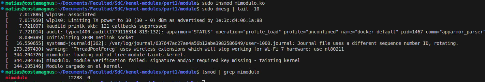
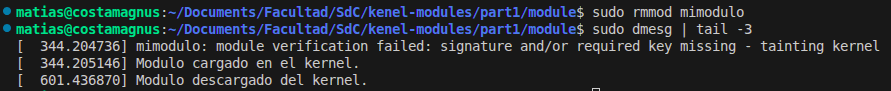
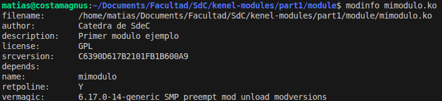
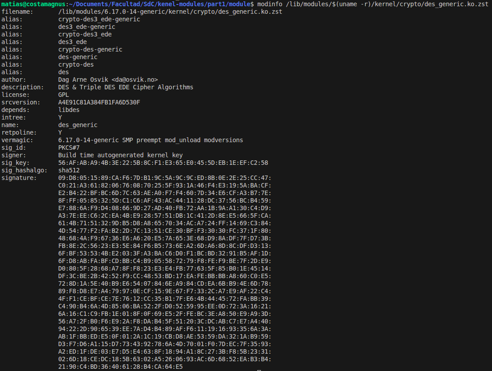
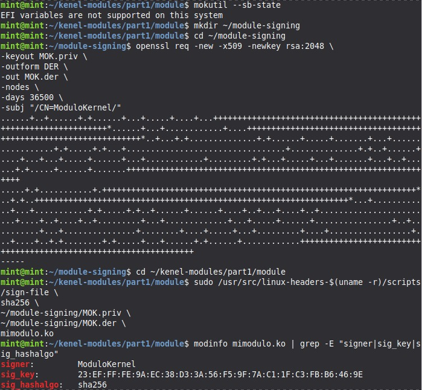
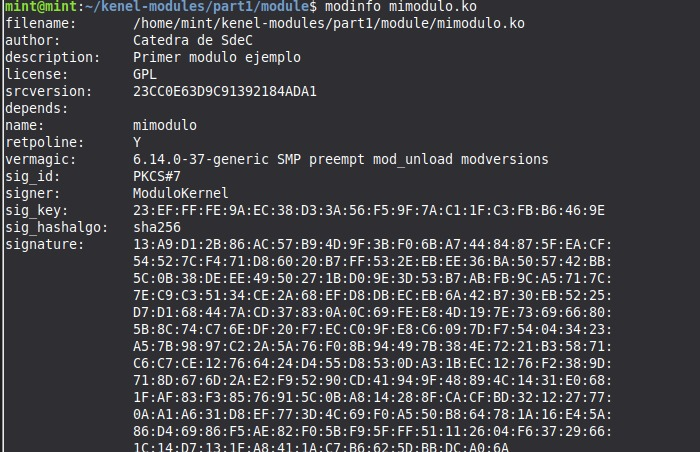

# Módulos de Kernel de Linux

**Asignatura:** Sistemas de Computación  

**Profesores:** 
  - Jorge, Javier Alejandro
  - Solinas, Miguel Angel

**Estudiantes:** 
  - Costamagna, Matias
  - Davila Tomassi, Carlos Valentino
  - Sabena, Maria Pilar

**Link del repositorio:** https://github.com/Mati-Costamagna/sudo-apruebenos/tree/TP4

**Fecha:** Mayo 2026

---

## Introducción

Un módulo de kernel es un fragmento de código que puede cargarse y descargarse en el kernel de Linux de forma dinámica, sin necesidad de reiniciar el sistema. Esta capacidad permite extender la funcionalidad del kernel en tiempo de ejecución: los drivers de dispositivos, los sistemas de archivos y los protocolos de red son ejemplos típicos de funcionalidad implementada como módulos.

La alternativa a los módulos sería un kernel monolítico donde toda funcionalidad se compila estáticamente en la imagen del kernel. Esto implica que cualquier nueva característica exigiría recompilar y reiniciar el sistema, lo cual resulta impráctico en entornos de producción.

A diferencia de un programa de usuario, un módulo se ejecuta en el **espacio del kernel** (ring 0), con acceso directo al hardware y a las estructuras internas del sistema operativo. Esta diferencia tiene implicancias profundas: un puntero inválido en espacio de usuario genera un `segmentation fault` y el proceso termina; el mismo error en espacio de kernel puede corromper el sistema entero y forzar un reinicio. El kernel no tiene la red de seguridad que el SO le ofrece a los procesos de usuario.

## Objetivos del trabajo

Este trabajo práctico cubre los siguientes temas:

- **Ciclo de vida de un módulo:** compilación, carga con `insmod`, descarga con `rmmod`, inspección con `lsmod`, `modinfo` y `/proc/modules`.
- **Espacio de usuario vs. espacio de kernel:** diferencias en funciones disponibles, manejo de errores y acceso a recursos.
- **Drivers y el directorio `/dev`:** relación entre módulos de kernel y los archivos de dispositivo que exponen al espacio de usuario.
- **Llamadas al sistema:** uso de `strace` para observar la interfaz entre un proceso y el kernel.
- **Firma de módulos y Secure Boot:** mecanismos para restringir la carga de módulos no firmados y sus implicancias en la seguridad del arranque.
- **`checkinstall`:** empaquetado de software compilado manualmente en paquetes del sistema (`.deb`).

## Herramientas y entorno

```bash
# Dependencias
sudo apt-get install build-essential checkinstall kernel-package linux-source

# Repositorio base de la cátedra
# https://gitlab.com/sistemas-de-computacion-unc/kenel-modules.git
```

El desarrollo se realiza sobre Linux nativo. Algunos puntos de la consigna requieren hardware real para observar módulos de dispositivos cargados en el sistema (comparación entre integrantes del grupo).

---

## Desarrollo

### 1. Setup y primer módulo

Se clonó el repositorio de la cátedra y se compiló el módulo de ejemplo:

```bash
git clone https://gitlab.com/sistemas-de-computacion-unc/kenel-modules.git
cd kenel-modules/part1/module
make
```

La compilación genera `mimodulo.ko`. A continuación se cargó en el kernel:

```bash
sudo insmod mimodulo.ko
sudo dmesg | tail -10
lsmod | grep mimodulo
```

Salida de `dmesg` al cargar el módulo y verificación con `lsmod`:



Las tres líneas reflejan el comportamiento esperado para un módulo sin firma:

1. El kernel advierte que es un módulo *out-of-tree* (no parte del árbol oficial del kernel) y marca el kernel como *tainted*.
2. La verificación de firma falla porque el módulo no está firmado con una clave en el keyring del sistema.
3. A pesar del taint, el módulo se carga y ejecuta `modulo_lin_init()`.

Para descargar el módulo:

```bash
sudo rmmod mimodulo
sudo dmesg | tail -3
```

Salida de `dmesg` al descargar:



Luego de `rmmod`, tanto `lsmod | grep mimodulo` como `cat /proc/modules | grep mimodulo` no devuelven resultado, confirmando que el módulo fue removido completamente del kernel.

### 2. Inspección con modinfo y /proc/modules

Se usó `modinfo` para comparar los metadatos del módulo propio con un módulo oficial del kernel.

**Nota sobre el formato `.ko.zst`:** A partir del kernel 5.19, Ubuntu distribuye los módulos comprimidos con Zstandard (`.ko.zst`) en lugar del tradicional `.ko`. El comando `modinfo /lib/modules/$(uname -r)/kernel/crypto/des_generic.ko` falla porque el archivo no existe sin extensión; la ruta correcta es con `.ko.zst`. `modinfo` soporta este formato de forma transparente.

```bash
modinfo mimodulo.ko
modinfo /lib/modules/$(uname -r)/kernel/crypto/des_generic.ko.zst
```

Salida de `modinfo mimodulo.ko`:



Salida de `modinfo des_generic.ko.zst`:



**Comparación de campos:**

| Campo | `mimodulo.ko` | `des_generic.ko.zst` |
|---|---|---|
| `author` | Catedra de SdeC | Dag Arne Osvik |
| `description` | Primer modulo ejemplo | DES & Triple DES EDE Cipher Algorithms |
| `depends` | *(ninguno)* | `libdes` |
| `intree` | *(ausente)* | `Y` |
| `alias` | *(ninguno)* | 8 aliases crypto |
| `sig_id` / `sig_key` | *(ausente — sin firma)* | PKCS#7 / clave autogenerada en build |
| `vermagic` | idéntico en ambos | idéntico en ambos |

Las diferencias más relevantes son:

- **`intree: Y`** indica que `des_generic` forma parte del árbol oficial del kernel; `mimodulo` no tiene este campo porque es un módulo externo (*out-of-tree*).
- **Firma (`sig_*`)**: `des_generic` está firmado con una clave autogenerada durante la compilación del kernel de Ubuntu. `mimodulo` carece de firma, lo que produjo el mensaje de *taint* al cargarlo.
- **`alias`**: los módulos del kernel pueden registrar aliases para que `modprobe` los cargue automáticamente al detectar hardware compatible. Un módulo simple de ejemplo no necesita aliases.
- **`vermagic`**: es idéntico en ambos porque ambos fueron compilados para el mismo kernel (`6.17.0-14-generic`). Si difirieran, el kernel rechazaría la carga.

### 3. Módulos cargados por integrante del grupo

Cada integrante exportó la lista de módulos activos en su sistema:

```bash
lsmod > lsmod_<nombre>.txt
```

Los archivos individuales están disponibles en el repositorio (`lsmod_costamagna.txt`, `lsmod_davila.txt`, `lsmod_sabena.txt`).

**Módulos cargados vs. disponibles (Costamagna):**

| Métrica | Valor |
|---|---|
| Módulos actualmente cargados | 197 |
| Módulos disponibles en `/lib/modules/` | 6769 |
| Porcentaje cargado | ~2.9 % |

La diferencia es significativa: el kernel carga únicamente los módulos necesarios para el hardware detectado y los servicios activos. Los 6569 módulos restantes están disponibles en disco pero inactivos; `modprobe` o `udev` los cargarán automáticamente si el hardware correspondiente es detectado o si un proceso los solicita.

**Módulos cargados vs. disponibles (Davila Tomassi):**
| Métrica                                | Valor  |
| -------------------------------------- | ------ |
| Módulos actualmente cargados           | 142    |
| Módulos disponibles en `/lib/modules/` | 6542   |
| Porcentaje cargado                     | ~2.1 % |

El sistema utilizado por Davila corresponde a una máquina virtual, por lo que la cantidad de módulos cargados es ligeramente menor respecto a los equipos físicos de los demás integrantes. La mayoría de los drivers activos corresponden a hardware virtualizado provisto por el hipervisor, como adaptadores de red emulados, audio virtual y controladores gráficos virtuales

**Módulos cargados vs. disponibles (Sabena)**

| Métrica | Valor |
|---|---|
| Módulos actualmente cargados | 163 |
| Módulos disponibles en `/lib/modules/` | 6377 |
| Porcentaje cargado | ~2.6 % |

Solo se carga alrededor del 2.6 % de los módulos disponibles en disco. El resto permanece inactivo hasta que `udev` detecte el hardware correspondiente o algún proceso lo solicite explícitamente via `modprobe`.


**¿Qué pasa cuando un driver no está disponible?**

Cuando se conecta un dispositivo y el módulo que lo gestiona no existe en el sistema, el kernel emite en `dmesg` un mensaje similar a:

```
usbcore: registered new interface driver <nombre>
<nombre>: probe failed with error -22
```

O bien `udev` intenta cargarlo con `modprobe` y falla silenciosamente. El dispositivo queda sin funcionalidad (no aparece en `/dev` o aparece pero sin driver asociado). El sistema no se interrumpe: simplemente ese hardware queda inoperativo.


#### Comparación de módulos entre integrantes

```bash
diff lsmod_costamagna.txt lsmod_sabena.txt lsmod_davila.txt
```
| Aspecto            | Costamagna              | Sabena                                        | Davila                              |
| ------------------ | ----------------------- | --------------------------------------------- | ----------------------------------- |
| **GPU**            | AMD (`amdgpu`)          | Intel integrado (`i915`)                      | VMware virtual (`vmwgfx`)           |
| **Audio**          | AMD (`snd_sof_amd_acp`) | Intel Tiger Lake (`snd_sof_intel_hda_common`) | Intel AC97 virtual (`snd_intel8x0`) |
| **WiFi**           | Intel (`iwlwifi`)       | MediaTek (`mt7921e`)                          | —                                   |
| **Virtualización** | AMD-V (`kvm_amd`)       | VT-x (`kvm_intel`)                            | VMware virtual machine              |
| **Contenedores**   | Docker activo           | Sin contenedores                              | Sin contenedores                    |


Lo que se ve en la tabla tiene sentido: cada sistema carga exactamente los drivers del hardware que tiene instalado. La GPU, el chip de audio y la placa WiFi son distintos en cada máquina, entonces los módulos también lo son. Lo único que coincide entre los tres sistemas son los subsistemas genéricos como USB, Bluetooth o la cámara, que funcionan igual en cualquier equipo.

### 4. Hardware real: hwinfo

Cada integrante instaló y ejecutó la herramienta de diagnóstico de hardware `hwinfo` para relevar los componentes físicos del sistema y comprender de manera empírica qué módulos del kernel se necesitan activar para darles soporte.

Los comandos utilizados en la terminal para instalar la utilidad y exportar el informe resumido fueron:

```bash
sudo apt install hwinfo
hwinfo --short > hwinfo_apellido.txt
```


Los reportes completos se encuentran adjuntos en los siguientes archivos del repositorio:
- [Reporte de Matias Costamagna](hwinfo_costamagna.txt)
- [Reporte de Carlos Valentino Davila](hwinfo_davila.txt) 
- [Reporte de Pilar Sabena](hwinfo_sabena.txt)

**Breve descripción del hardware detectado (Matias Costamagna):**

El sistema de Costamagna está basado en un procesador **AMD Ryzen 7 4700U** (arquitectura Renoir, 8 núcleos) con gráficos integrados **ATI Renoir** gestionados por el driver `amdgpu`. El almacenamiento es un SSD **Samsung NVMe** (`/dev/nvme0n1`), soportado por el driver `nvme`. La conectividad inalámbrica y Bluetooth provienen de una placa **Intel Wi-Fi 6 AX200**, que utiliza el módulo `iwlwifi`. El audio es manejado por `snd_hda_intel` a través del controlador AMD Family 17h HD Audio. Se detectaron también interfaces de red virtuales correspondientes a Docker (`docker0`) y libvirt (`virbr0`), lo que confirma los módulos de virtualización y contenedores (`kvm_amd`, `bridge`) visibles en la Sección 3.

**Breve descripción del hardware detectado (Davila Tomassi Carlos Valentino):**

El sistema de Davila se ejecuta dentro de una máquina virtual VMware sobre un host con procesador **AMD Ryzen 5 5600G** with Radeon Graphics. El adaptador gráfico detectado utiliza el driver **vmwgfx**, encargado de proveer aceleración gráfica virtualizada. La interfaz de red corresponde a un dispositivo Intel emulado mediante el **módulo e1000**, mientras que el audio utiliza el **controlador virtual snd_intel8x0**. A diferencia de los sistemas físicos analizados por los otros integrantes, gran parte del hardware visible para el kernel corresponde a dispositivos virtualizados generados por el hipervisor y no a periféricos físicos reales.

**Breve descripción del hardware detectado (Pilar Sabena):**
Al inspeccionar el archivo `hwinfo_sabena.txt`, se observa que el kernel de Linux interactúa directamente con una arquitectura basada en **Intel** (procesador y gráficos integrados a través del driver `i915`), componentes de almacenamiento masivo **NVMe**, y adaptadores de red inalámbrica gestionados dinámicamente por módulos del kernel. Esto ratifica el análisis de la Sección 3, donde los módulos cargados en memoria responden estrictamente a este inventario de componentes físicos.

### 5. Modulo vs Programa

La diferencia más básica está en cómo empiezan, terminan y qué pueden usar.

Un programa normal arranca desde `main()`, hace lo suyo y cuando termina le devuelve el control al sistema operativo. Un módulo no tiene `main()`: tiene `module_init()` para cuando se carga y `module_exit()` para cuando se descarga. Entre medio no "corre" de forma continua — queda registrado en el kernel esperando que algo lo invoque.

La otra diferencia importante es qué funciones tienen disponibles. Un programa puede llamar a cualquier función de la biblioteca estándar de C (`printf`, `malloc`, etc.), que internamente hacen llamadas al sistema. Un módulo no puede usar nada de eso: solo puede llamar a las funciones que el propio kernel exporta. Esos símbolos están listados en `/proc/kallsyms`.

Y la consecuencia más importante de todo esto: un programa corre en espacio de usuario, así que si falla, el SO lo mata y el resto del sistema sigue andando. Un módulo corre en espacio de kernel, al mismo nivel que el propio SO. Si un módulo hace algo mal — un puntero inválido, por ejemplo — no hay nadie que lo atrape: el kernel puede caerse entero.

| Aspecto | Programa de usuario | Módulo de kernel |
|---|---|---|
| Punto de entrada | `main()` | `module_init()` / `module_exit()` |
| Librería estándar | libc disponible | No disponible; solo kernel headers |
| Fallo por puntero inválido | SIGSEGV → proceso termina | Kernel oops / panic |
| Espacio de ejecución | Ring 3 (user space) | Ring 0 (kernel space) |
| Acceso a hardware | Vía syscalls | Directo |
| Herramienta de debug | gdb, strace | dmesg, kgdb, /proc |

### 6. Llamadas al sistema de un hello world

Se compiló y ejecutó un programa simple con `strace` para observar qué syscalls realiza:

```bash
gcc -Wall -o hello hello.c
strace ./hello
strace -c ./hello
```

La salida completa de cada integrante está en `strace_apellido.txt` respectivamente en el repositorio. 

**Análisis de la salida (Sabena)**

Lo primero que llama la atención es la cantidad de syscalls que genera un programa tan simple: 35 llamadas en total para imprimir una sola línea. Esto se explica porque la mayor parte del trabajo no es el `printf` en sí, sino la inicialización del proceso y la carga de la libc.

El flujo que se puede seguir en la salida es este:

- `execve` — el kernel arranca el proceso cargando el binario
- `openat` + `mmap` — el linker dinámico busca y mapea en memoria la librería `libc.so.6`
- `brk` + `mmap` — se reserva memoria para el heap y otros segmentos
- `write(1, "Hola Sistemas de Computacion!\n", 30)` — acá es donde ocurre el `printf` real: una sola llamada a `write` sobre el descriptor 1 (stdout)
- `exit_group(0)` — el proceso termina

El punto importante es que `printf` no es una syscall: es una función de la libc que internamente termina llamando a `write`, que sí lo es. Todo lo que un programa hace "visible" al SO pasa por esta interfaz de syscalls, y `strace` permite verla completa.

**Análisis de la salida (Costamagna)**

El output sigue el mismo flujo general pero presenta diferencias concretas respecto al de mi compañera, que reflejan distintas versiones de kernel y entornos de sistema:

- **36 líneas de traza vs 35 syscalls** — el conteo es prácticamente idéntico; la diferencia en el archivo se explica por la línea final `+++ exited with 0 +++` que `strace` agrega pero no es una syscall.
- **`fstat` vs `newfstatat`** — mi salida usa `fstat(3, ...)` para inspeccionar los archivos del linker, mientras que Sabena usa `newfstatat(3, "", ..., AT_EMPTY_PATH)`. Ambas hacen lo mismo (obtener metadatos de un fd), pero `newfstatat` es la variante más nueva introducida en kernels recientes para unificar la familia `stat`. Esto indica que los dos sistemas tienen versiones de libc distintas.
- **`arch_prctl(0x3001 ...)` ausente** — Mi compañera tiene una llamada extra `arch_prctl(0x3001 /* ARCH_??? */, ...)` que falla con `EINVAL`. El código `0x3001` corresponde a `ARCH_GET_XCOMP_SUPP`, una syscall para consultar soporte de "extended CPU state components" (relacionado con AMX/AVX-512 en Intel). El kernel de Sabena la intenta porque su libc la incluyó, pero el hardware no la soporta y devuelve error. En mi entorno esta llamada directamente no aparece, probablemente porque usa una versión de libc diferente que no la emite.
- **Tamaño del `ld.so.cache`** — Se mapea en 92.951 bytes vs 74.375 bytes de Sabena. El cache del linker es proporcional a la cantidad de librerías instaladas en el sistema; mi entorno tiene más librerías registradas.
- **Variables de entorno** — `execve` muestra 84 variables en el entorno vs 62 en el de Sabena. Esto es simplemente el estado de la sesión de shell de cada uno al momento de ejecutar el programa, sin impacto funcional.

En ambos casos el resultado es el mismo: una sola llamada `write(1, "Hola Sistemas de Computacion!\n", 30)` produce el output visible, y `exit_group(0)` cierra el proceso limpiamente. Las diferencias son ruido del entorno, no del programa.

**Análisis de la salida (Davila)**

La traza obtenida en strace_davila.txt sigue el mismo patrón general observado por los demás integrantes. El proceso comienza con execve, donde el kernel carga el binario hello, seguido de múltiples llamadas relacionadas con la carga dinámica de bibliotecas (openat, mmap, access, read). Estas syscalls pertenecen principalmente al linker dinámico y a la inicialización del entorno de ejecución de la libc.

También se observan llamadas a brk y mmap, utilizadas para reservar memoria para el heap y otras estructuras internas del proceso. Finalmente, el printf del programa termina traducido en una syscall write sobre el descriptor estándar de salida (stdout), confirmando nuevamente que las funciones de la libc actúan como una capa de abstracción sobre las syscalls reales del kernel.

Las diferencias observadas respecto a las demás trazas son menores y responden principalmente al entorno virtualizado utilizado por Davila y a diferencias en las versiones de bibliotecas instaladas en el sistema.
Los reportes completos se encuentran en el repositorio:
- [strace Matias Costamagna](strace_costamagna.txt)
- [strace Carlos Valentino Davila](strace_davila.txt) 
- [strace Maria Pilar Sabena](strace_sabena.txt)

### 7. Segmentation Fault

Un segmentation fault ocurre cuando un proceso intenta acceder a una dirección de memoria que no le corresponde: leer o escribir fuera de su espacio asignado, desreferenciar un puntero nulo, etc.

Se compiló y ejecutó `segfault.c`, un programa que desreferencia un puntero nulo:

```c
#include <stdio.h>

int main() {
    int *p = NULL;
    *p = 42;   /* provoca SIGSEGV: escritura en dirección nula */
    return 0;
}
```

```bash
gcc -o segfault segfault.c
./segfault
```

Salida observada:

```
Segmentation fault (core dumped)
```

El proceso terminó con código de salida 139 (128 + señal 11 = SIGSEGV). El resto del sistema continuó funcionando sin inconvenientes.

Cuando eso pasa en un programa de usuario, el hardware genera una excepción (page fault) que el kernel intercepta. El kernel determina que el acceso es inválido, le manda la señal `SIGSEGV` al proceso y lo termina. El resto del sistema no se ve afectado.

En un módulo de kernel la historia es distinta. No hay nadie por encima que pueda interceptar el error y contenerlo. Un acceso de memoria inválido en espacio de kernel genera un **kernel panic** o un **oops** — el sistema puede quedar inestable o directamente reiniciarse. No hay red de seguridad.

### 8. Firma de modulo

Con el objetivo de experimentar el mecanismo de firmado de módulos del kernel Linux, se generó un par de claves RSA utilizando OpenSSL y posteriormente se utilizó el script `sign-file` incluido en los headers del kernel.

Primero se creó un directorio para almacenar las claves criptográficas:

```bash
mkdir ~/module-signing
cd ~/module-signing
```
Luego se generó una clave privada y un certificado público mediante:
```bash
openssl req -new -x509 -newkey rsa:2048 \
-keyout MOK.priv \
-outform DER \
-out MOK.der \
-nodes \
-days 36500 \
-subj "/CN=ModuloKernel/"
```
Esto produjo:

`MOK.priv`: clave privada RSA.
`MOK.der`: certificado público.

Posteriormente se recompiló el módulo y se verificó que inicialmente no tenía firma:

```bash
make clean
make
modinfo mimodulo.ko | grep sig
```

La salida no devolvió ningún resultado, confirmando que el módulo recién compilado carece de firma.

A continuación se utilizó el script `sign-file` provisto por los headers del kernel para firmarlo:

```bash
sudo /usr/src/linux-headers-$(uname -r)/scripts/sign-file \
  sha256 ~/module-signing/MOK.priv \
         ~/module-signing/MOK.der \
         mimodulo.ko
```

El script `sign-file` toma cuatro argumentos: el algoritmo de hash (`sha256`), la clave privada, el certificado público y el módulo a firmar. La firma se adjunta directamente al final del archivo `.ko`.

Para verificar que la firma fue aplicada correctamente se usó `modinfo`:

```bash
modinfo mimodulo.ko | grep sig
```

La salida mostró los campos de firma presentes en el módulo:

```
sig_id:         PKCS#7
signer:         ModuloKernel
sig_key:        ...
sig_hashalgo:   sha256
signature:      ...
```

La carga del módulo se realizó mediante:
```bash
sudo insmod mimodulo.ko
```
y los mensajes del kernel fueron verificados utilizando:
```bash
sudo dmesg | tail -5
```
La salida mostró correctamente:
```bash
Modulo cargado en el kernel - Equipo sudo ApruebenOS
```
Luego el módulo fue descargado mediante:
```bash
sudo rmmod mimodulo
```
La salida mostró correctamente:
```bash
Modulo descargado en el kernel - Equipo sudo ApruebenOS
```
Esto permitió comprobar correctamente la ejecución de las rutinas de inicialización y liberación del módulo firmado dentro del kernel Linux.

### 9. Evidencia de la compilación, carga y descarga de su propio módulo imprimiendo el nombre del equipo en los registros del kernel. 

## Generación de la firma y las claves RSA


Se puede leer en la consola, cuando generamos la firma, la siguiente línea "EFI variables are not supported on this system."
La máquina virtual utilizada no posee soporte para variables EFI/UEFI, por lo que `mokutil` no puede consultar el estado de Secure Boot. Esto indica que el entorno virtualizado se encuentra utilizando BIOS legado o una configuración sin soporte UEFI. Aun así, fue posible realizar el firmado criptográfico del módulo y verificar la presencia de la firma mediante `modinfo`.



### 10.¿Que pasa si mi compañero con secure boot habilitado intenta cargar un módulo firmado por mi?

Aunque un módulo se encuentre firmado, el kernel solamente confiará en él si la clave pública correspondiente se encuentra registrada dentro del firmware UEFI o dentro del sistema MOK (Machine Owner Key).

Por lo tanto, si un compañero con `Secure Boot` habilitado intenta cargar un módulo firmado con una clave privada ajena, el sistema probablemente rechazará la carga del módulo debido a que la firma no pertenece a una entidad confiable registrada localmente.

En nuestro caso, el módulo fue firmado utilizando una clave RSA generada localmente por uno de los integrantes del grupo. Sin embargo, dicha clave no forma parte de las claves confiables almacenadas en el firmware UEFI ni fue importada mediante MOK. Por este motivo, si otro integrante intenta cargar el módulo firmado en una computadora con Secure Boot habilitado, el kernel rechazará la operación indicando que la firma no pertenece a una autoridad confiable.

Esto demuestra que no alcanza únicamente con firmar un módulo: además es necesario que la clave pública utilizada para validar la firma esté registrada dentro de la cadena de confianza del sistema.

En consecuencia, el módulo no podrá cargarse salvo que previamente se importe y registre la clave pública utilizada para generar la firma.

### 11. Consecuencia principal del parche de Microsoft sobre GRUB en sistemas con arranque dual
Según el artículo analizado, Microsoft distribuyó una actualización de seguridad relacionada con Secure Boot y la base de datos DBX (*Forbidden Signature Database*) utilizada por UEFI para bloquear bootloaders vulnerables.
La actualización tenía como objetivo bloquear versiones vulnerables de GRUB asociadas a la vulnerabilidad conocida como *Boothole*, la cual permitía modificar el proceso de arranque incluso teniendo Secure Boot habilitado. Para solucionar este problema, Microsoft actualizó la lista de binarios considerados inseguros dentro del firmware.


La consecuencia principal fue que numerosos sistemas Linux con arranque dual (Windows + Linux) dejaron de iniciar correctamente. Muchas instalaciones utilizaban versiones de GRUB que pasaron a ser bloqueadas por el firmware luego de la actualización de la DBX, impidiendo el arranque del sistema Linux incluso cuando la instalación era legítima y funcional anteriormente.

El problema afectó especialmente a sistemas donde:
- el bootloader no había sido actualizado,
- existían configuraciones personalizadas,
- o se utilizaban distribuciones menos mantenidas.

Esto evidenció cómo una modificación en la cadena de confianza de Secure Boot puede afectar directamente la compatibilidad y disponibilidad de los sistemas operativos instalados.


## Implicancia de desactivar Secure Boot como solución al problema

Una de las soluciones más utilizadas por los usuarios afectados fue desactivar Secure Boot desde la configuración UEFI/BIOS del sistema.

Al desactivar Secure Boot, el firmware deja de verificar firmas digitales durante el arranque. Como consecuencia:
- GRUB vuelve a ejecutarse normalmente,
- pueden cargarse kernels o bootloaders no firmados,
- y el sistema vuelve a iniciar incluso si utiliza versiones bloqueadas por la DBX.

Sin embargo, esta solución implica una reducción importante del nivel de seguridad del sistema. El objetivo principal de Secure Boot es impedir que software malicioso se ejecute antes del sistema operativo, especialmente bootkits o rootkits capaces de modificar el proceso de arranque.

Sin Secure Boot habilitado:
- cualquier bootloader puede ejecutarse,
- se pierde la cadena de confianza criptográfica,
- y resulta más sencillo para un atacante persistir a bajo nivel dentro del sistema.

Por lo tanto, aunque desactivar Secure Boot puede resolver temporalmente problemas de compatibilidad, también elimina una de las principales barreras de protección presentes en sistemas modernos.

## Propósito principal de Secure Boot

Secure Boot es un mecanismo de seguridad incorporado en UEFI cuyo objetivo principal es garantizar que únicamente software confiable y firmado criptográficamente pueda ejecutarse durante el proceso de arranque.

El funcionamiento se basa en una cadena de confianza:
1. El firmware UEFI verifica la firma del bootloader.
2. El bootloader verifica el kernel.
3. El kernel puede verificar módulos y componentes adicionales.

Cada etapa valida criptográficamente la siguiente antes de permitir su ejecución. De esta manera se evita que código no autorizado o modificado pueda ejecutarse antes de que el sistema operativo tome control del hardware.

El principal objetivo de este mecanismo es proteger al sistema frente a amenazas de muy bajo nivel, especialmente:
- bootkits,
- rootkits,
- malware persistente en el arranque,
- modificaciones maliciosas del kernel,
- y ataques orientados a comprometer el sistema antes de que el antivirus o las protecciones tradicionales puedan activarse.

En entornos empresariales y servidores, Secure Boot representa además un mecanismo fundamental para mantener integridad y trazabilidad del software ejecutado desde el inicio del sistema.

---

### Desafío #1: checkinstall y seguridad de módulos

#### Empaquetado con checkinstall

`checkinstall` permite empaquetar software compilado manualmente en un paquete del sistema (`.deb`, `.rpm` o `.tgz`), de modo que pueda ser gestionado por el gestor de paquetes nativo. Esto evita la instalación "sucia" con `make install` directo, que no deja rastro en el sistema de paquetes.

El proceso para empaquetar el `hello` del TP:

```bash
sudo apt install checkinstall

# Crear Makefile con target install
cat > Makefile <<'EOF'
install:
	install -m 755 hello /usr/local/bin/hello-tp4
EOF

# Compilar
gcc -o hello hello.c

# Empaquetar
sudo checkinstall --pkgname=hello-tp4 --pkgversion=1.0 --default make install
```

`checkinstall` intercepta la ejecución de `make install`, registra todos los archivos que se copian al sistema y genera un `.deb` instalable. Al finalizar, el paquete queda instalado y registrado:

```bash
dpkg -l | grep hello-tp4
```

Salida esperada:

```
ii  hello-tp4  1.0  amd64  hello-tp4
```

Para desinstalarlo limpiamente: `sudo dpkg -r hello-tp4`.

#### Seguridad de módulos: `module.sig_enforce` y rootkits

El parámetro de kernel `module.sig_enforce=1` (pasado como argumento al arranque en GRUB) instruye al kernel a **rechazar cualquier módulo sin firma válida** verificable contra el keyring del sistema:

```
error: Module <nombre> has no signature
insmod: ERROR: could not insert module: Required key not available
```

Sin este parámetro, el kernel acepta módulos sin firma (con advertencia de *taint*). Con él activado, la carga falla directamente.

**Relación con rootkits de kernel:**

Un rootkit de kernel opera insertando un módulo `.ko` malicioso que puede ocultar procesos, interceptar syscalls o abrir puertas traseras. El vector de ataque requiere inevitablemente llamar a `insmod` o `init_module`. Si `sig_enforce=1` está activo y la clave del atacante no está en el keyring del sistema:

1. El kernel rechaza el módulo antes de ejecutar ninguna de sus instrucciones.
2. Para registrar una nueva clave en el keyring se requiere acceso físico al firmware UEFI (MOK) o recompilar el kernel — ambos escenarios ya implican compromiso total del sistema.

Por lo tanto, `sig_enforce=1` cierra el vector de carga dinámica de código malicioso en ring 0, sin afectar a los módulos del sistema correctamente firmados durante la compilación del kernel.

---

### Desafío #2: espacios de ejecución y drivers

#### El directorio `/dev`

El directorio `/dev` es el punto de contacto entre el espacio de usuario y los drivers del kernel. Cada archivo en `/dev` representa un dispositivo y es gestionado por un módulo de kernel.

```bash
ls -la /dev | head -20
```

Salida representativa:

```
crw-rw-rw-  1 root tty       5,   0 may 21 10:00 tty
brw-rw----  1 root disk      8,   0 may 21 10:00 sda
crw-rw-rw-  1 root root      1,   3 may 21 10:00 null
```

El primer carácter indica el tipo:
- `b` — dispositivo de bloque (*block device*): acceso aleatorio por bloques, con caché de página (discos, particiones).
- `c` — dispositivo de caracteres (*char device*): acceso secuencial byte a byte (terminales, `/dev/null`, puertos serie).

Los dos números separados por coma son **major:minor**:
- **Major number**: identifica el driver responsable del dispositivo.
- **Minor number**: distingue entre instancias gestionadas por el mismo driver (ej: `sda`, `sda1`, `sda2` comparten major pero difieren en minor).

Para asociar un dispositivo concreto con su módulo de kernel:

```bash
udevadm info --query=all --name=/dev/sda | grep -E "DRIVER|MODULE"
```

Salida representativa:

```
E: ID_DRIVE_TYPE=disk
E: ID_BUS=pci
```

O bien buscando por el major number en `/proc/devices`:

```bash
cat /proc/devices | grep -i nvme
```

#### Tabla de funciones: user space vs kernel space

| Función | User space | Kernel space |
|---|---|---|
| Imprimir | `printf()` | `printk()` |
| Alocar memoria | `malloc()` | `kmalloc()` |
| Dormir | `sleep()` | `msleep()` |
| Acceso a archivos | `fopen()`, `fread()` | `filp_open()`, `kernel_read()` |
| Sincronización | `pthread_mutex` | `spinlock`, `mutex` |

La diferencia no es solo de nombres: `malloc` puede bloquear esperando que el SO libere páginas; `kmalloc` no puede bloquear en ciertos contextos (interrupciones) y puede fallar si la memoria no está disponible de forma inmediata. `printf` es thread-safe y con buffer; `printk` es atómica y va directo al ring buffer del kernel.

#### Diagrama de espacios de ejecución

```
┌─────────────────────────────────────────┐
│            USER SPACE (Ring 3)          │
│  Procesos, libc, heap, stack de usuario │
├─────────────────────────────────────────┤
│         SYSCALL INTERFACE               │
│   (write, read, open, mmap, ioctl…)     │
├─────────────────────────────────────────┤
│           KERNEL SPACE (Ring 0)         │
│  Módulos, drivers, VFS, scheduler, MM   │
├─────────────────────────────────────────┤
│              HARDWARE                   │
└─────────────────────────────────────────┘
```

Los módulos de kernel viven en Ring 0, el mismo nivel que el scheduler, el sistema de memoria virtual y los subsistemas de red. No existe barrera de protección entre ellos: un bug en un módulo puede corromper estructuras del scheduler o la memoria de otro proceso sin ninguna red de seguridad.

---

## Conclusión

A lo largo del trabajo se recorrió el ciclo completo de vida de un módulo de kernel: compilación, carga, inspección y descarga. Los mensajes de `dmesg` al cargar un módulo sin firma —*out-of-tree*, *signature missing*, *tainted*— no son alertas abstractas sino el registro exacto del modelo de confianza del kernel: acepta el módulo pero documenta que ya no puede garantizar la integridad del sistema.

La comparación de `lsmod` entre los tres integrantes confirmó que el kernel aplica un principio de carga mínima: lo que se carga en memoria es exactamente lo que el hardware presente requiere, ni más ni menos. Los reportes de `hwinfo` cerraron ese circuito mostrando la correspondencia directa entre cada periférico y su driver.

Ejecutar `strace` sobre un `hello world` hizo visible algo que normalmente es transparente: una sola llamada a `printf` se traduce en más de 35 syscalls, y el kernel solo ve `write(1, ..., 30)`. La libc es una capa de abstracción sustancial que el programador da por sentada.

El experimento con `segfault.c` materializó la diferencia entre ring 3 y ring 0: el mismo error de puntero nulo que en user space produce `Segmentation fault (core dumped)` y deja el sistema intacto, en kernel space genera un *oops* o *panic* sin red de seguridad. Esa asimetría no es un detalle de implementación: es una consecuencia directa del modelo de privilegios del procesador.

Finalmente, firmar el módulo con OpenSSL y analizar el caso del parche de Microsoft sobre GRUB permitió concluir que Secure Boot es una garantía de dos filos: cuando la cadena de confianza funciona, es la única barrera efectiva contra código malicioso en ring 0; cuando esa cadena se rompe por una decisión externa, el impacto recae directamente sobre el usuario. `module.sig_enforce=1` representa el extremo más estricto de esa cadena: sin firma válida, no hay carga posible.
