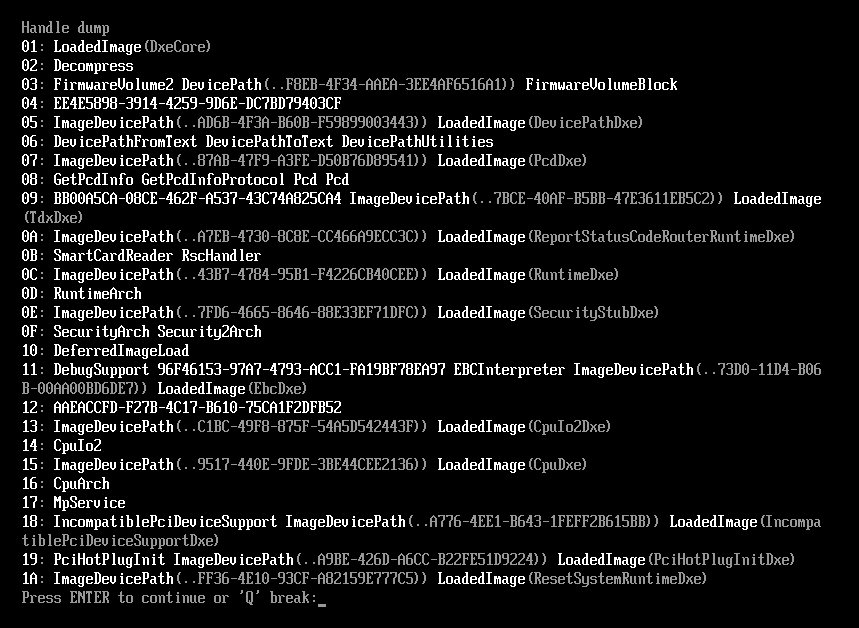
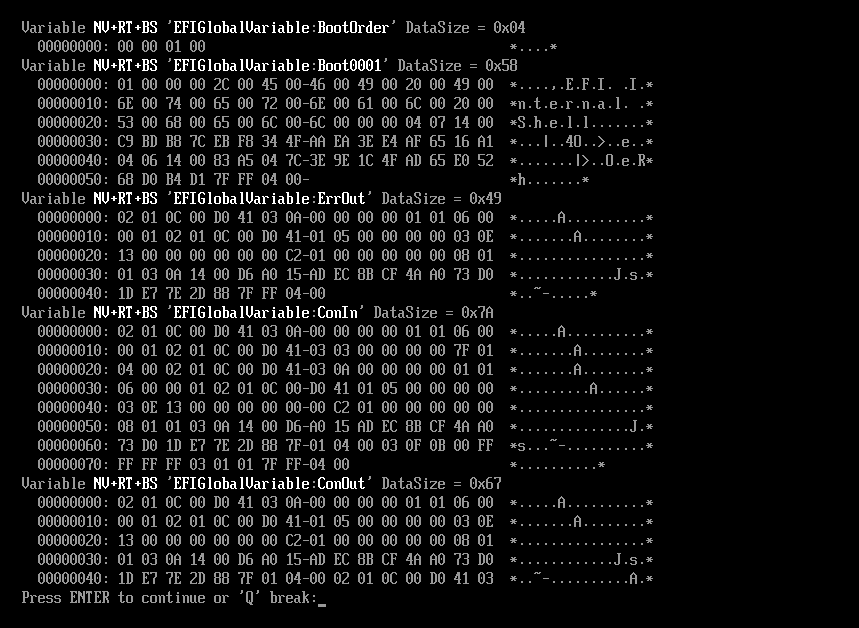
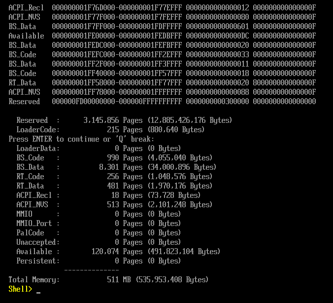
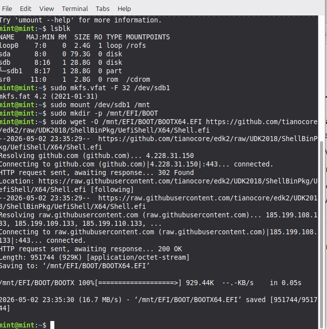
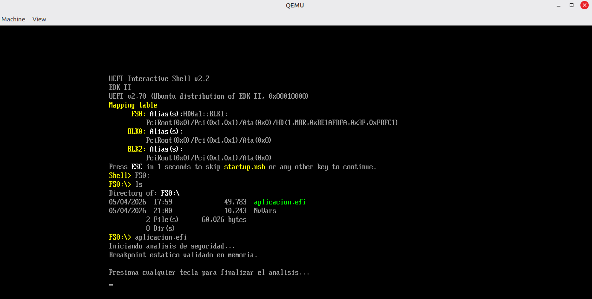
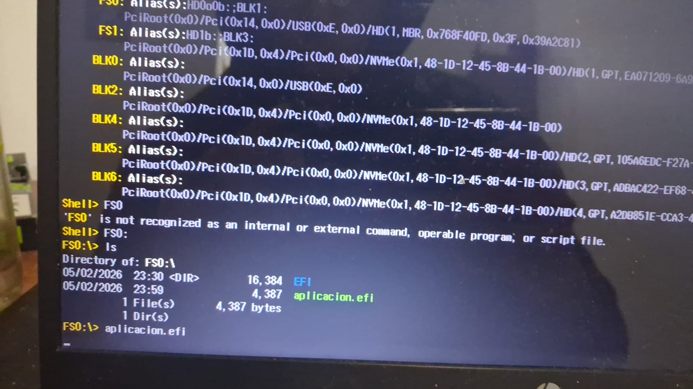

# Interfaz de Firmware Extensible Unificada (UEFI) 

**Asignatura:** Sistemas de Computación  

**Profesores:** 
  - Jorge, Javier Alejandro
  - Solinas, Miguel Angel

**Estudiantes:** 
  - Costamagna, Matias
  - Davila Tomassi, Carlos Valentino
  - Sabena, Maria Pilar

**Link del repositorio:** https://github.com/Mati-Costamagna/sudo-apruebenos/tree/TP3a

**Fecha:** Mayo 2026

---

## Introducción

Este trabajo es la continuación directa del trabajo anterior sobre **Modo Real y Modo Protegido**, donde se estudió cómo el procesador x86 arranca en Real Mode (16 bits, 1 MB de memoria, sin protección), se construyó un sector de arranque MBR en ensamblador y se ejecutó la transición a **Modo Protegido** configurando una GDT y activando el bit `PE=1` en `CR0`. Ese trabajo dejó al procesador en un entorno controlado de 32 bits, ejecutando código directamente sobre el hardware sin sistema operativo.

El presente trabajo parte de ese punto y da el siguiente paso: **¿qué hay entre el reset del procesador y el momento en que arranca el sistema operativo en una computadora moderna?** La respuesta es **UEFI** (Unified Extensible Firmware Interface), el estándar que reemplazó al BIOS Legacy y que opera en las fases previas al OS gestionando la inicialización del hardware, la memoria y los dispositivos de arranque.

### Lo que se hizo en el trabajo anterior

- Construcción de un MBR de 512 bytes en ensamblador (GAS/AT&T), con firma `0x55 0xAA`.
- Configuración de la **GDT** (Global Descriptor Table) para definir segmentos de código y datos.
- Transición de Real Mode a **Protected Mode de 32 bits** activando `PE=1` en `CR0`.
- Salida por VGA directa (sin OS, sin BIOS) desde Protected Mode.
- Ejecución en QEMU y en hardware físico (Lenovo T450).

### Lo que se busca en este trabajo

- Comprender la arquitectura de **Platform Initialization (PI)**: las fases SEC, PEI, DXE, BDS y RT que organizan el arranque moderno.
- Desarrollar una **aplicación nativa UEFI** en C usando `gnu-efi`, compilarla al formato **PE/COFF** mediante un pipeline de tres etapas (`gcc` → `ld` → `objcopy`), y ejecutarla en el entorno pre-OS.
- Analizar el binario resultante con herramientas de ingeniería inversa (**Ghidra**) para entender cómo un descompilador interpreta opcodes a nivel de firmware, en particular la instrucción `INT3` (`0xCC`) y su representación como `-52` en complemento a dos.
- Conectar los conceptos del trabajo anterior (modos del procesador, MBR, formato de ejecutables bare-metal) con su equivalente moderno en el ecosistema UEFI.

---

## Estructura del repositorio

| Directorio | Contenido |
|---|---|
| `parte1/` | TP1: Exploración del entorno UEFI y la Shell (comandos `map`, `dh`, `dmpstore`, `memmap`) |
| `parte2/` | TP2: Desarrollo, compilación y análisis de seguridad |
| `parte3/` | TP3: Ejecución en hardware físico (bare metal, USB booteable) |

---

## TP1: Exploración del entorno UEFI y la Shell

**Objetivo:** Explorar cómo UEFI abstrae el hardware y gestiona la configuración antes de la carga del sistema operativo.

### Arranque en el entorno virtual

Para explorar el entorno UEFI sin hardware específico, se usó **QEMU** como emulador y **OVMF** como firmware:

```bash
qemu-system-x86_64 -m 512 -bios /usr/share/ovmf/OVMF.fd -net none
```

A diferencia del BIOS Legacy que simplemente saltaba al MBR en `0x7C00`, UEFI arranca con una shell interactiva completa (**UEFI Interactive Shell v2.2**) con su propio sistema de archivos, consola y gestión de memoria.

### Exploración de Handles y Protocolos

UEFI no usa puertos de hardware fijos ni interrupciones como el BIOS. En cambio mantiene una base de datos de **Handles** (identificadores de entidades) que agrupan **Protocolos** (interfaces de software identificadas por GUIDs).



```
Shell> map
Shell> dh -b
```


El comando `map` mostró el único dispositivo de bloque (`BLK0`) con su ruta completa en el árbol PCI: `PciRoot(0x0)/Pci(0x1,0x1)/Ata(0x0)`. El comando `dh -b` listó todos los Handles del sistema: `DxeCore`, `RuntimeArch`, `CpuArch`, `SecurityArch`, `DebugSupport`, entre otros.

### Variables de NVRAM y secuencia de arranque

La fase BDS decide qué cargar basándose en variables no volátiles almacenadas en NVRAM:

```
Shell> dmpstore -b
Shell> set TestSeguridad "Hola UEFI"
Shell> set -v
```



Se observaron las variables `BootOrder` (`00 00 01 00`) y `Boot0001` apuntando a la UEFI Shell interna. El Boot Manager lee `BootOrder`, itera cada entrada `Boot####` en orden y llama a `LoadImage()` con la Device Path correspondiente hasta encontrar un binario válido.

### Mapa de memoria y hardware

```
Shell> memmap -b
Shell> pci -b
Shell> drivers -b
```


El mapa de memoria reveló las regiones clave: `BS_Code` (990 páginas, liberadas al cargar el OS), `RT_Code` (256 páginas, **permanecen mapeadas en el OS**) y `RT_Data` (481 páginas). Los comandos `pci` y `drivers` listaron los 5 dispositivos PCI emulados y los drivers cargados por DXE (`PciBusDxe`, `DiskIoDxe`, `PartitionDxe`, `SataController`, `GraphicsConsoleDxe`, entre otros).

### Hallazgo clave: regiones RuntimeServicesCode como vector de ataque

Las regiones `RT_Code` son el objetivo principal de los **bootkits** porque sobreviven a `ExitBootServices()`, ejecutan en Ring 0 con acceso total a la memoria, y son invisibles para cualquier software de seguridad que corra dentro del OS. Más aún, ciertas implementaciones aprovechan el **System Management Mode (SMM)** — un modo de ejecución en "Anillo -2", por debajo incluso del hipervisor — completamente transparente para el OS. Bootkits reales como *LoJax* (2018) y *CosmicStrand* (2022) usaron exactamente este vector para lograr persistencia a nivel de firmware.


> Ver desarrollo completo en [`parte1/README.md`](parte1/README.md)

---

## TP2: Desarrollo, compilación y análisis de seguridad

**Objetivo:** Crear una aplicación nativa UEFI en C, compilarla al formato PE/COFF y analizar cómo un descompilador interpreta sus opcodes a nivel de firmware.

### Contexto: dónde corre el código


La aplicación desarrollada corre en la fase **BDS**, luego de que **DXE** estableció el entorno de 64 bits con GDT y servicios UEFI activos. El procesador ya transitó por Real Mode (SEC) → Protected Mode 32-bit (PEI) → Long Mode 64-bit (DXE), el mismo recorrido estudiado en el trabajo anterior pero gestionado ahora por el firmware UEFI en lugar de nuestro propio código ensamblador.

### Pipeline de compilación

El binario no se compila con un simple `gcc` — UEFI requiere el formato **PE/COFF** (el mismo de los `.exe` de Windows), lo que impone un proceso de tres etapas:

```
aplicacion.c
     │  gcc  (-ffreestanding, -fpic, sin libc)
     ▼
aplicacion.o  (ELF relocatable)
     │  ld   (linker script UEFI + crt0)
     ▼
aplicacion.so (ELF shared object)
     │  objcopy  (reempaquetar secciones)
     ▼
aplicacion.efi (PE/COFF — ejecutable nativo UEFI)
```

A diferencia del MBR del trabajo anterior (512 bytes crudos, cargado siempre en `0x7C00`), el PE/COFF incluye una tabla de reubicaciones `.reloc` que permite al firmware cargarlo en cualquier dirección física disponible (`ImageBase = 0x0`).

### Análisis con Ghidra

El binario compilado se importó en **Ghidra** para analizar cómo el descompilador interpreta el código a nivel de firmware.


El panel izquierdo muestra el desensamblado x86-64 con las variables de stack y sus referencias cruzadas (XREF). El panel derecho muestra el pseudocódigo reconstruido, donde `SystemTable->ConOut->OutputString` aparece como una doble derreferencia de puntero: `(**(...)(unaff_RSI + 0x40) + 8))`.

#### Hallazgo clave: `0xCC` = `-52`

La aplicación embebe el opcode `0xCC` (instrucción `INT3`, breakpoint de software) en un array y lo compara en tiempo de ejecución. Al compilar con `-O0` para desactivar optimizaciones, el `CMP` y el `JNZ` son visibles en el desensamblado. Al aplicar **Convert → Signed Decimal** en Ghidra sobre el operando, `0xCC` se representa como `-52`:


`0xCC` (204 sin signo) = `-52` en complemento a dos de 8 bits, porque el bit más significativo está en 1. Este fenómeno es relevante en ciberseguridad: un analista que no reconozca la equivalencia `-52 ↔ 0xCC ↔ INT3` puede pasar por alto técnicas de anti-debugging o breakpoints intencionales en malware de firmware.

#### Nota: `OutputString` vs `Print()` — por qué el binario de Ghidra congela al bootear

El código analizado en Ghidra llama a `SystemTable->ConOut->OutputString` directamente desde C. Eso es intencional para el análisis: la llamada directa produce la doble derreferencia visible en el decompilador (`(**(...)(unaff_RSI + 0x40) + 8))`), que muestra con claridad cómo UEFI expone sus servicios a través de punteros a función en estructuras anidadas.

Sin embargo, **ese mismo binario congela la pantalla al ejecutarse en hardware real o en QEMU**. La causa es un choque de ABI:

| ABI | Primer argumento | Segundo argumento |
|-----|-----------------|-------------------|
| System V AMD64 (Linux, lo que genera `gcc`) | `RDI` | `RSI` |
| Microsoft x64 (UEFI) | `RCX` | `RDX` |

Cuando `gcc` en Linux compila `OutputString(ConOut, L"texto")`, coloca `ConOut` en `RDI` y el string en `RSI`. El firmware UEFI los espera en `RCX` y `RDX`. El resultado es que la función recibe basura en sus parámetros y el comportamiento es indefinido — en la práctica, la pantalla se congela y hay que reiniciar.

`Print()` de `efilib.h` resuelve esto porque internamente usa `uefi_call_wrapper`, un wrapper de `gnu-efi` que ajusta la convención de llamada antes de invocar la función del firmware. Para llamadas directas a protocolos (como `ConIn->ReadKeyStroke`) se usa `uefi_call_wrapper` explícitamente con la misma finalidad.

El código fue modificado en TP3 reemplazando todas las llamadas directas por `Print()` y `uefi_call_wrapper`. La diferencia en Ghidra es que `Print()` aparece como una llamada a función nombrada en lugar de la doble derreferencia — menos ilustrativo para el análisis, pero el único que produce un `.efi` funcional.

> Ver análisis completo en [`parte2/README.md`](parte2/README.md)

---

## TP3: Ejecución en hardware físico (bare metal, USB booteable)

**Objetivo:** Preparar un medio de arranque USB con la aplicación UEFI desarrollada en TP2 y ejecutarla sobre hardware real, sin sistema operativo intermedio.

### El estándar ESP y preparación del pendrive

UEFI no puede bootear desde cualquier sistema de archivos — requiere una **EFI System Partition (ESP)** formateada en **FAT32**, porque el firmware incluye nativamente un driver de FAT32 pero no de otros sistemas como ext4 o NTFS. La especificación define una ruta fija para el bootloader por defecto:

```
/EFI/BOOT/BOOTX64.EFI   ← ruta fija para el bootloader por defecto (64 bits)
```

El pendrive se formateó en FAT32 y se montó con la estructura de directorios estándar. Se copiaron la **UEFI Shell de TianoCore** (renombrada como `BOOTX64.EFI`) y `aplicacion.efi` generada en TP2. Al arrancar desde el USB con Secure Boot desactivado, el firmware carga automáticamente la Shell, desde donde se ejecuta la aplicación.



### Descubrimiento: choque de ABI en hardware real

Al ejecutar el binario original en la Notebook HP y en una PC de escritorio, la pantalla se congelaba y había que reiniciar. El mismo comportamiento se reproducía en QEMU. La causa era un **choque de ABI**:

| ABI | Primer argumento | Segundo argumento |
|-----|-----------------|-------------------|
| System V AMD64 (Linux, lo que genera `gcc`) | `RDI` | `RSI` |
| Microsoft x64 (UEFI) | `RCX` | `RDX` |

El código original llamaba a `SystemTable->ConOut->OutputString` directamente, por lo que `gcc` en Linux colocaba los argumentos en `RDI`/`RSI` mientras que el firmware los esperaba en `RCX`/`RDX`. La corrección fue reemplazar todas las llamadas directas por `Print()` de `efilib.h` y usar `uefi_call_wrapper` para `ConIn->ReadKeyStroke`, que internamente ajustan la convención de llamada antes de invocar la función del firmware.

### Verificación en QEMU y ejecución en hardware

Con el código corregido y recompilado, la ejecución funciona correctamente tanto en QEMU como sobre la Notebook HP:




```
Iniciando analisis de seguridad...
Breakpoint estatico validado en memoria.

Presiona cualquier tecla para finalizar el analisis...
```



> Ver análisis completo en [`parte3/README.md`](parte3/README.md)


---

## Conclusión

La arquitectura UEFI no es solo un reemplazo del BIOS Legacy: es un modelo completo de inicialización de plataforma organizado en fases (SEC → PEI → DXE → BDS → RT) donde cada etapa entrega al siguiente un entorno más rico. El trabajo anterior había construido manualmente esa transición — Real Mode, GDT, bit PE=1 en CR0 — en 512 bytes de ensamblador sin ninguna abstracción. UEFI hace exactamente lo mismo pero mediado por drivers, Handles y Protocolos: DXE establece el entorno de 64 bits y registra los servicios en la `EFI_SYSTEM_TABLE`; BDS lee `BootOrder` de NVRAM, llama a `LoadImage()` y entrega el control a la aplicación. La exploración con QEMU/OVMF y los comandos `map`, `dh`, `dmpstore` y `memmap` permitió observar esa maquinaria en tiempo real: cada driver, cada región de memoria y cada variable de arranque tienen una representación explícita en el sistema, algo que con el BIOS era completamente opaco.

La aplicación desarrollada en C con `gnu-efi` ilustra las consecuencias prácticas de esa arquitectura. El pipeline de compilación — `gcc` sin libc, `ld` con linker script UEFI, `objcopy` para reempaquetar a PE/COFF — existe porque UEFI impone un formato de ejecutable con tabla de reubicaciones `.reloc`: a diferencia del MBR que el BIOS siempre carga en `0x7C00`, `LoadImage()` asigna la dirección en tiempo de ejecución y aplica los fixups. Ese detalle también explica el choque de ABI que se descubrió al ejecutar en hardware real: compilar en Linux genera convención System V AMD64, pero UEFI exige la Microsoft x64 ABI. Usar `Print()` y `uefi_call_wrapper` no es una preferencia de estilo sino una corrección funcional que la diferencia entre una pantalla congelada y una ejecución limpia.

El análisis con Ghidra cierra el recorrido desde el otro extremo: partiendo del binario PE/COFF final, el decompilador reconstruye `efi_main` como dobles dereferences de puntero sobre `unaff_RSI`, que es exactamente `SystemTable->ConOut->OutputString` visto sin información de tipos. La representación de `0xCC` como `-52` no es una rareza del decompilador sino una consecuencia directa de cómo x86 codifica operandos inmediatos de 8 bits con signo: el mismo patrón de bits `11001100` que es el opcode `INT3` es también `-52` en complemento a dos. En análisis de firmware malicioso esa equivalencia tiene peso real — es la forma en que técnicas de anti-debugging quedan ocultas para quien no conoce la representación.
