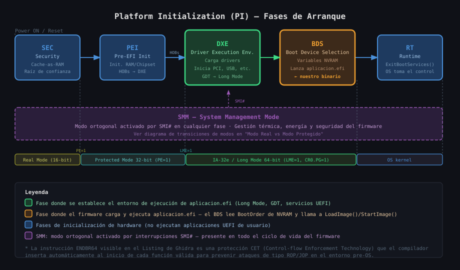
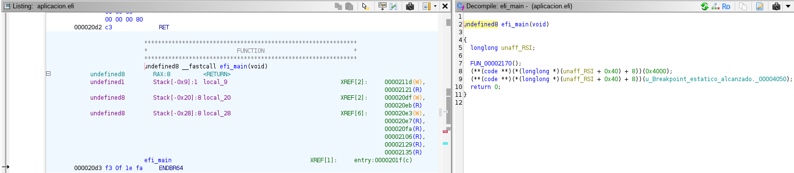
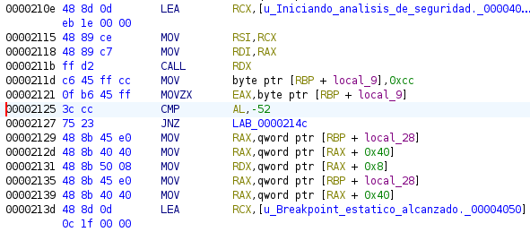

# Interfaz de Firmware Extensible Unificada (UEFI) 

**Asignatura:** Sistemas de Computación  

**Profesores:** 
  - Jorge, Javier Alejandro
  - Solinas, Miguel Angel

**Estudiantes:** 
  - Costamagna, Matias
  - Davila Tomassi, Carlos Valentino
  - Sabena, Maria Pilar

**Link del repositorio:** https://github.com/Mati-Costamagna/sudo-apruebenos/tree/TP3a

**Fecha:** Mayo 2026

---

## Introducción

Este trabajo es la continuación directa del trabajo anterior sobre **Modo Real y Modo Protegido**, donde se estudió cómo el procesador x86 arranca en Real Mode (16 bits, 1 MB de memoria, sin protección), se construyó un sector de arranque MBR en ensamblador y se ejecutó la transición a **Modo Protegido** configurando una GDT y activando el bit `PE=1` en `CR0`. Ese trabajo dejó al procesador en un entorno controlado de 32 bits, ejecutando código directamente sobre el hardware sin sistema operativo.

El presente trabajo parte de ese punto y da el siguiente paso: **¿qué hay entre el reset del procesador y el momento en que arranca el sistema operativo en una computadora moderna?** La respuesta es **UEFI** (Unified Extensible Firmware Interface), el estándar que reemplazó al BIOS Legacy y que opera en las fases previas al OS gestionando la inicialización del hardware, la memoria y los dispositivos de arranque.

### Lo que se hizo en el trabajo anterior

- Construcción de un MBR de 512 bytes en ensamblador (GAS/AT&T), con firma `0x55 0xAA`.
- Configuración de la **GDT** (Global Descriptor Table) para definir segmentos de código y datos.
- Transición de Real Mode a **Protected Mode de 32 bits** activando `PE=1` en `CR0`.
- Salida por VGA directa (sin OS, sin BIOS) desde Protected Mode.
- Ejecución en QEMU y en hardware físico (Lenovo T450).

### Lo que se busca en este trabajo

- Comprender la arquitectura de **Platform Initialization (PI)**: las fases SEC, PEI, DXE, BDS y RT que organizan el arranque moderno.
- Desarrollar una **aplicación nativa UEFI** en C usando `gnu-efi`, compilarla al formato **PE/COFF** mediante un pipeline de tres etapas (`gcc` → `ld` → `objcopy`), y ejecutarla en el entorno pre-OS.
- Analizar el binario resultante con herramientas de ingeniería inversa (**Ghidra**) para entender cómo un descompilador interpreta opcodes a nivel de firmware, en particular la instrucción `INT3` (`0xCC`) y su representación como `-52` en complemento a dos.
- Conectar los conceptos del trabajo anterior (modos del procesador, MBR, formato de ejecutables bare-metal) con su equivalente moderno en el ecosistema UEFI.

---

## Estructura del repositorio

| Directorio | Contenido |
|---|---|
| `parte1/` | TP1: Exploración del entorno UEFI y la Shell (comandos `map`, `dh`, `dmpstore`, `memmap`) |
| `parte2/` | TP2: Desarrollo, compilación y análisis de seguridad |
| `parte3/` | TP3: Ejecución en hardware físico (bare metal, USB booteable) |

---

## TP1: Exploración del entorno UEFI y la Shell

---

## TP2: Desarrollo, compilación y análisis de seguridad

**Objetivo:** Crear una aplicación nativa UEFI en C, compilarla al formato PE/COFF y analizar cómo un descompilador interpreta sus opcodes a nivel de firmware.

### Contexto: dónde corre el código



La aplicación desarrollada corre en la fase **BDS**, luego de que **DXE** estableció el entorno de 64 bits con GDT y servicios UEFI activos. El procesador ya transitó por Real Mode (SEC) → Protected Mode 32-bit (PEI) → Long Mode 64-bit (DXE), el mismo recorrido estudiado en el trabajo anterior pero gestionado ahora por el firmware UEFI en lugar de nuestro propio código ensamblador.

### Pipeline de compilación

El binario no se compila con un simple `gcc` — UEFI requiere el formato **PE/COFF** (el mismo de los `.exe` de Windows), lo que impone un proceso de tres etapas:

```
aplicacion.c
     │  gcc  (-ffreestanding, -fpic, sin libc)
     ▼
aplicacion.o  (ELF relocatable)
     │  ld   (linker script UEFI + crt0)
     ▼
aplicacion.so (ELF shared object)
     │  objcopy  (reempaquetar secciones)
     ▼
aplicacion.efi (PE/COFF — ejecutable nativo UEFI)
```

A diferencia del MBR del trabajo anterior (512 bytes crudos, cargado siempre en `0x7C00`), el PE/COFF incluye una tabla de reubicaciones `.reloc` que permite al firmware cargarlo en cualquier dirección física disponible (`ImageBase = 0x0`).

### Análisis con Ghidra

El binario compilado se importó en **Ghidra** para analizar cómo el descompilador interpreta el código a nivel de firmware.



El panel izquierdo muestra el desensamblado x86-64 con las variables de stack y sus referencias cruzadas (XREF). El panel derecho muestra el pseudocódigo reconstruido, donde `SystemTable->ConOut->OutputString` aparece como una doble derreferencia de puntero: `(**(...)(unaff_RSI + 0x40) + 8))`.

#### Hallazgo clave: `0xCC` = `-52`

La aplicación embebe el opcode `0xCC` (instrucción `INT3`, breakpoint de software) en un array y lo compara en tiempo de ejecución. Al compilar con `-O0` para desactivar optimizaciones, el `CMP` y el `JNZ` son visibles en el desensamblado. Al aplicar **Convert → Signed Decimal** en Ghidra sobre el operando, `0xCC` se representa como `-52`:



`0xCC` (204 sin signo) = `-52` en complemento a dos de 8 bits, porque el bit más significativo está en 1. Este fenómeno es relevante en ciberseguridad: un analista que no reconozca la equivalencia `-52 ↔ 0xCC ↔ INT3` puede pasar por alto técnicas de anti-debugging o breakpoints intencionales en malware de firmware.

> Ver análisis completo en [`parte2/README.md`](parte2/README.md)

---

## TP3: Ejecución en hardware físico (bare metal, USB booteable)

---