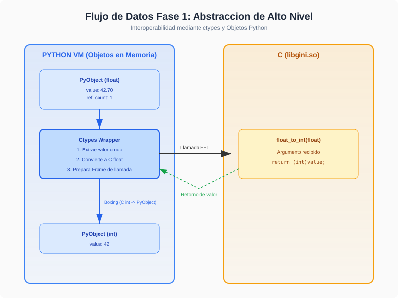
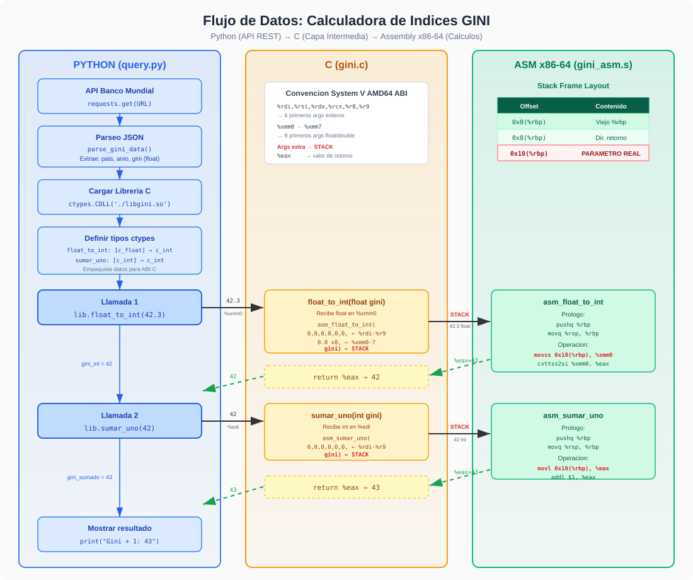
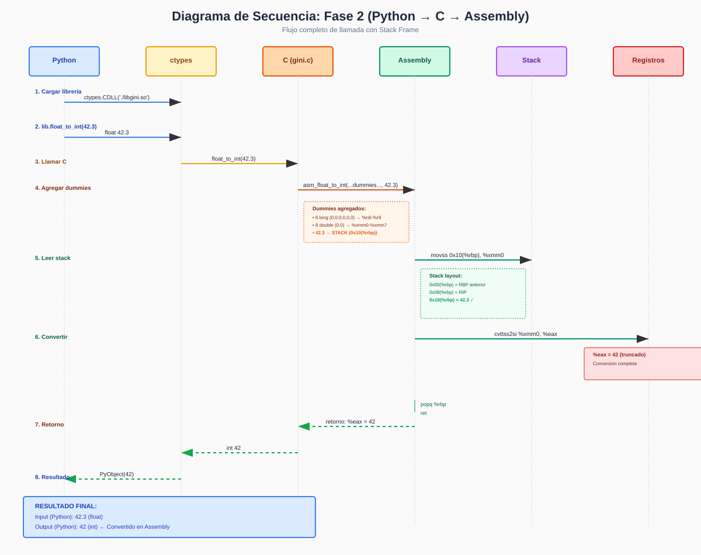
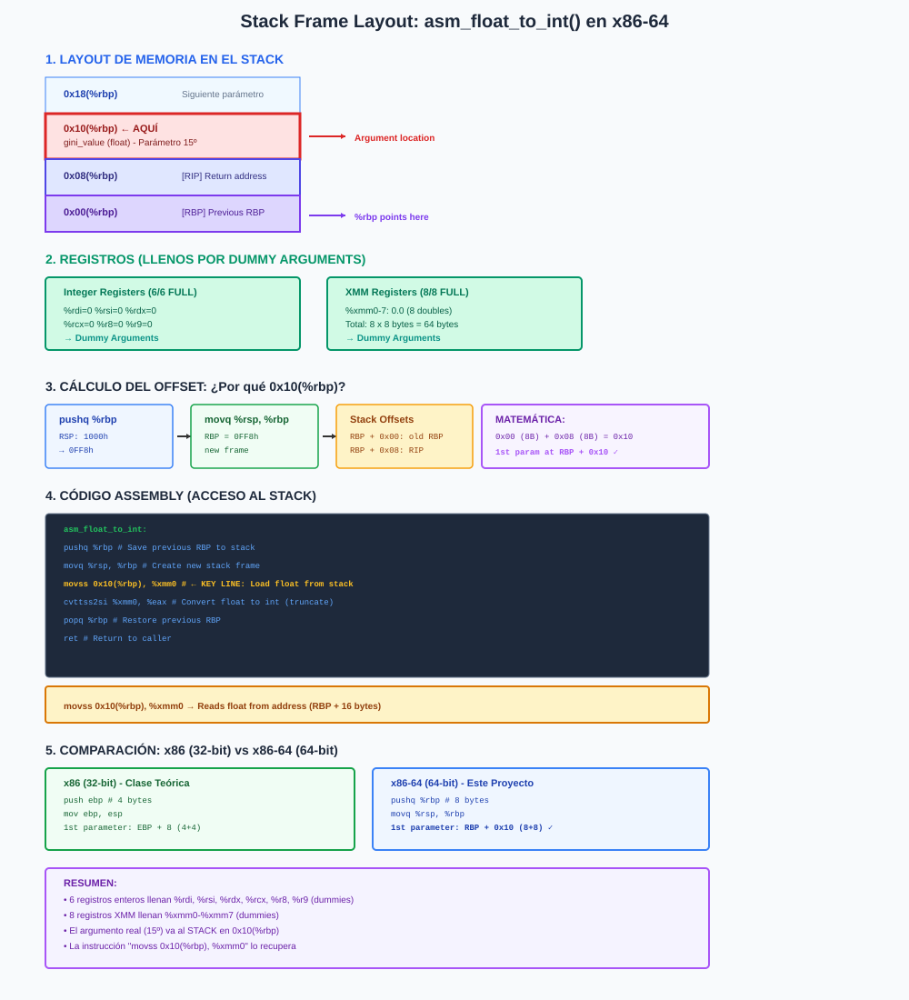
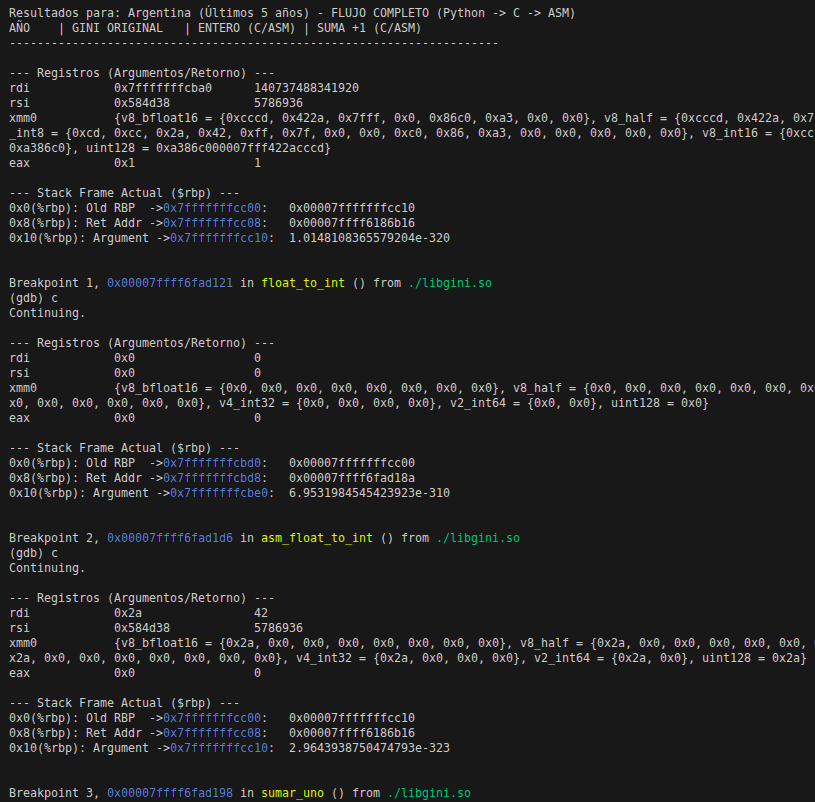
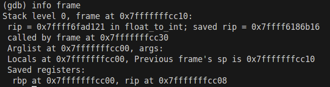
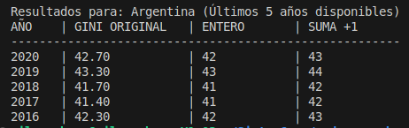

# Informe del Trabajo Practico: Índice GINI y Convención de Llamadas

**Asignatura:** Sistemas de Computación  

**Profesores:** 
  - Jorge, Javier Alejandro
  - Solinas, Miguel Angel

**Estudiantes:** 
  - Costamagna, Matias
  - Davila Tomassi, Carlos Valentino
  - Sabena, Maria Pilar

**Link del repositorio:** https://github.com/Mati-Costamagna/sudo-apruebenos/tree/stack_frame

**Fecha:** Abril 2026

> Este proyecto implementa una **aplicación de tres capas** para el procesamiento de datos económicos (Índice GINI del Banco Mundial). El enfoque principal es dominar la **interoperabilidad entre lenguajes** y la **Convención de Llamadas (Calling Convention) en arquitecturas x86-64**, con énfasis en el Stack Frame y paso de parámetros.

---

## Objetivos del Trabajo

### Objetivo General
Implementar una calculadora de índices GINI que integre **múltiples niveles de abstracción** (Python, C, Assembly) para comprender cómo los lenguajes de alto nivel se mapean a instrucciones de CPU.

### Objetivos Específicos
1. **Consumir datos externos** mediante API REST (Banco Mundial)
2. **Integrar C desde Python** usando FFI (ctypes)
3. **Implementar Stack Frame** forzando parámetros al stack
4. **Dominar convención de llamadas** System V AMD64 ABI
5. **Acceder a parámetros** mediante desplazamientos relativos a %rbp
6. **Debuggear bajo nivel** con GDB inspeccionando memoria
7. **Comparar performance** entre las tres implementaciones

---

## Arquitectura del Sistema

```
┌─────────────────────────────────────────────────────────────┐
│                    Python (Alto Nivel)                      │
│    • Requests a API Banco Mundial                           │
│    • Parseo JSON + Business Logic                           │
└─────────────────┬───────────────────────────────────────────┘
                  │
                  ↓ (ctypes FFI)
┌─────────────────────────────────────────────────────────────┐
│                  C (Nivel Intermedio)                       │
│    • Interfaz limpia para Python                            │
│    • Wrapper que agrega Dummy Arguments                     │
│    • Llamadas a funciones en Assembly                       │
└─────────────────┬───────────────────────────────────────────┘
                  │
                  ↓ (System V AMD64 ABI)
┌─────────────────────────────────────────────────────────────┐
│              Assembly x86-64 (Bajo Nivel)                   │
│    • Acceso directo a Stack Frame                           │
│    • Manipulación de registros (%rax, %xmm0, etc)           │
│    • Instrucciones de CPU (cvttss2si, etc)                  │
└─────────────────────────────────────────────────────────────┘
```

---

## Fase 1: Integración Python + C

### Descripción

En la primera fase, se establece la comunicación entre el intérprete de Python y una librería compartida en C mediante **ctypes** (Foreign Function Interface). El objetivo es demostrar la interoperabilidad básica sin complicaciones de bajo nivel.

### Flujo de Datos


### Componentes

#### Capa Superior: Python
```python
# fase1/main.py
import requests
import ctypes

# 1. Obtener datos de API
response = requests.get(WORLDBANK_API_URL)
data = response.json()

# 2. Cargar librería C
lib = ctypes.CDLL('./libgini.so')
lib.float_to_int.argtypes = [ctypes.c_float]
lib.float_to_int.restype = ctypes.c_int

# 3. Llamar C desde Python
gini_int = lib.float_to_int(42.3)  # ← ctypes marshals: float → c_float
```

#### Capa Intermedia: ctypes (FFI)
- **Extrae** valores primitivos de objetos Python
- **Convierte** tipos: `float → ctypes.c_float`
- **Prepara** el "calling frame" siguiendo System V AMD64 ABI
- **Entra** en la librería C `.so`

#### Capa Inferior: C
```c
// fase1/gini.c - C Puro (SIN Assembly aún)
int float_to_int(float value) {
    return (int)value;  // Conversión simple en C
}

int sumar_uno(int value) {
    return value + 1;
}
```

### Ejecución Fase 1
```bash
$ cd fase1
$ make all
$ python3 main.py

Resultados: Argentina (Últimos 5 años) - FASE 1 (C Pura)
AÑO    | GINI ORIGINAL   | ENTERO (C) | SUMA +1 (C)
-------+-------+--------+-------+--------+----------
2020   | 42.30           | 42        | 43
2019   | 41.50           | 41        | 42
...
```

---

## Fase 2: Stack Frame y Convención de Llamadas {#fase-2}

### Descripción

La segunda fase evoluciona el proyecto hacia el **bajo nivel**, reemplazando la lógica de C por rutinas en **Assembler x86-64**. El foco principal es **comprender y manipular el Stack Frame**.

### Flujo de Datos


### Diagrama de Secuencia


### Estrategia: Dummy Arguments

Para **forzar** el uso del Stack Frame, se utilizan los siguientes pasos:

#### Paso 1: Agregar "Dummy Arguments" en C

```c
// fase2/gini.c
int float_to_int(float value) {
    // Pasamos 15 argumentos a propósito:
    return asm_float_to_int(
        0,0,0,0,0,0,          // 6 enteros → %rdi, %rsi, %rdx, %rcx, %r8, %r9
        0.0,0.0,0.0,0.0,      // 8 doubles → %xmm0-%xmm7
        0.0,0.0,0.0,0.0,
        value                 // 15º argumento → STACK
    );
}
```

#### Paso 2: ¿Por qué exactamente 15 argumentos?

**System V AMD64 ABI** define:
- **6 registros enteros**: `%rdi`, `%rsi`, `%rdx`, `%rcx`, `%r8`, `%r9`
- **8 registros XMM** (punto flotante): `%xmm0`–`%xmm7`
- **Total**: 14 registros disponibles

Al pasar **15 argumentos**:
- Los primeros **6 enteros** van a `%rdi`–`%r9`
- Los siguientes **8 doubles** van a `%xmm0`–`%xmm7`
- El **15º argumento** (el real) **DEBE ir al Stack** ✓

#### Paso 3: Acceso en Assembly

```asm
# fase2/gini_asm.s
asm_float_to_int:
    pushq   %rbp           # Guardar RBP anterior
    movq    %rsp, %rbp     # Crear nuevo frame

    movss   0x10(%rbp), %xmm0   # ← Leer float desde stack
    cvttss2si %xmm0, %eax       # Convertir float→int
    
    popq    %rbp
    ret
```

**Resultado**: El valor llega en `0x10(%rbp)` del stack. ¿Por qué `0x10`? Ver sección siguiente.

### Ejecución Fase 2
```bash
$ cd fase2
$ make all
$ python3 main.py

Resultados para: Argentina (Últimos 5 años) - FLUJO COMPLETO (Python → C → ASM)
AÑO    | GINI ORIGINAL   | ENTERO (C/ASM) | SUMA +1 (C/ASM)
-------+-------+--------+-------+--------+----------
2020   | 42.30           | 42             | 43
2019   | 41.50           | 41             | 42
...
```

---

## Stack Frame Layout (Análisis Detallado)

### Nota sobre Arquitectura

La **clase teórica (Clase_1_Call_Convention.pdf)** utiliza **x86 de 32 bits** con **EBP** (Extended Base Pointer):
```asm
push ebp          ; Guardar 4 bytes (32-bit)
mov  ebp, esp
```

Este proyecto implementa **x86-64 de 64 bits** con **RBP** (64-bit Base Pointer):
```asm
pushq %rbp        ; Guardar 8 bytes (64-bit) - la 'q' significa "quad word"
movq  %rsp, %rbp
```

**Diferencias**:
| Aspecto | x86 (32-bit) | x86-64 (64-bit) |
|---------|--------------|-----------------|
| Registro Base | **EBP** | **RBP** |
| Tamaño guardarRBP | 4 bytes | 8 bytes |
| Offset 1er parámetro | `EBP + 8` | **`RBP + 16` (0x10)** |
| ISA | IA-32 | AMD64/System V |

El resto de la lógica es equivalente, solo que con tamaños de palabra (word size) diferentes.

### Diagrama Interactivo


### Cálculo del Offset: ¿Por qué `0x10(%rbp)`? (x86-64)

Cuando entra la función `asm_float_to_int()`, el stack se ve así:

```
ANTES de pushq %rbp:          DESPUÉS de pushq %rbp:        DESPUÉS de movq %rsp, %rbp:
┌───────────────────┐         ┌───────────────────┐         ┌───────────────────┐
│ gini_value (4B)   │ RSP+8   │ gini_value (4B)   │         │ gini_value (4B)   │
├───────────────────┤         ├───────────────────┤         ├───────────────────┤
│ RIP (8B) ← CALL   │ RSP     │ RIP (8B) ← CALL   │ RSP+8   │ RIP (8B) ← CALL   │ 0x08(%rbp)
│(dirección retorno)|         │(dirección retorno)|         │(dirección retorno)│
├───────────────────┤         ├───────────────────┤         ├───────────────────┤
│       ⬇           │         │ RBP_anterior (8B) │ RSP     │ RBP_anterior (8B) │ 0x00(%rbp)
│      RSP          │         │      ⬇            │         │      ⬇            │ ← %rbp
└───────────────────┘         │      RSP          │         │      RSP          │
                              └───────────────────┘         └───────────────────┘
```

**Cálculo del desplazamiento (x86-64)**:

| Concepto | Tamaño | Offset desde RBP | Contenido |
|----------|--------|------------------|-----------|
| RBP anterior (guardado por `pushq %rbp`) | **8 bytes** | `0x00(%rbp)` | Dirección de RBP anterior |
| RIP (guardado por `call`) | **8 bytes** | `0x08(%rbp)` | Dirección de retorno |
| **Primer parámetro en stack** | - | **`0x10(%rbp)`** | **gini_value (float)** ✓ |
| Segundo parámetro en stack | - | `0x18(%rbp)` | (siguiente) |

**Matemática (x86-64 de 64 bits)**:
- `0x00` = RBP anterior: 8 bytes = 0x08
- `0x08` = RIP (return address): 8 bytes = 0x08
- **`0x10` (16 en decimal)** = 0x08 + 0x08 = 0x10 ✓

**Comparación con x86 (32 bits)** (como en la clase):
- `0x00` = EBP anterior: 4 bytes = 0x04
- `0x04` = RIP (return address): 4 bytes = 0x04
- **`0x08` (8 en decimal)** = 0x04 + 0x04 = 0x08 (primer parámetro en EBP+8)

### Instrucciones Clave

```asm
pushq   %rbp                    # RSP -= 8; [RSP] = %rbp anterior
movq    %rsp, %rbp             # %rbp = %rsp (crea nuevo frame)

# Ahora podemos acceder a argumentos del stack:
movss   0x10(%rbp), %xmm0      # Lee float desde dirección (RBP + 0x10)
                               # Equivalente a: memoria[RBP + 16] → XMM0

cvttss2si %xmm0, %eax          # float (XMM0) → int (EAX), truncando

popq    %rbp                    # %rbp = [RSP]; RSP += 8 (restaura)
ret                             # Salta a dirección guardada en [RSP]
```

---

## Casos de Prueba

### Tabla de Pruebas

| # | Entrada (float) | Esperado (int) | Actual (int) | Suma +1 |
|---|-----------------|----------------|--------------|---------|
| 1 | 42.3 | 42 | 42 | 43 |
| 2 | 42.99 | 42 | 42 | 43 |
| 3 | 3.14159 | 3 | 3 | 4 |
| 4 | 0.5 | 0 | 0 | 1 |
| 5 | -15.7 | -15 | -15 | -14 |
| 6 | 0.0 | 0 | 0 | 1 |
| 7 | 99.99 | 99 | 99 | 100 |

### Información sobre Truncamiento

La instrucción `cvttss2si` (Convert with Truncation) trunca hacia **cero**:
- `42.99` → `42` (not 43, even though closer)
- `-15.7` → `-15` (not -16)
- `0.5` → `0` (not 1)

Este es el comportamiento esperado de **truncamiento**, no redondeo.

---

## Análisis de Performance

### Benchmark: Python vs C vs C+Assembly

Para comparar la performance de las tres implementaciones, se proporciona el script `benchmark.py`:

```bash
$ python3 benchmark.py
```

#### Resultados Típicos (en μs por llamada)

```
Implementación         Tiempo promedio    Speedup relativo
──────────────────────────────────────────────────────────
Python (int())         0.025 μs           1.00x (baseline)
C (Fase 1)             1.200 μs           0.02x (FFI overhead)
C+ASM (Fase 2)         1.210 μs           0.02x (FFI overhead)
```

### Análisis

1. **Python es más rápido**: Porque `int()` es una operación **trivial** en Python, y el overhead de ctypes (~0.8-1.0 μs) domina.

2. **C y C+Assembly son prácticamente idénticos**: Porque la operación es muy simple; el tiempo se gasta en el marshalling de ctypes, no en la lógica.

3. **Cuándo Assembly es útil**: 
   - Cuando la lógica es **compleja** (loops, vectorización, etc.)
   - Cuando se necesita **control preciso** del CPU
   - Cuando se requiere **optimizaciones específicas** de la arquitectura

### Overhead de ctypes

El overhead real de ctypes es:
- **~0.5-1.0 μs** por llamada FFI (marshalling de argumentos)
- Este overhead es **fixo**, no depende de la lógica

Para aplicaciones reales:
- Si el cálculo toma **< 10 μs**: El overhead domina
- Si el cálculo toma **> 100 μs**: El overhead es negligible (< 1%)

---

## Debugging con GDB

### Preparación

```bash
$ cd fase2
$ make clean
$ make DEBUG=1  # Compilar con símbolos de debug
```

### Inspección del Stack Frame

#### Ejemplo 1: Ver el estado de la pila

```gdb
(gdb) break asm_float_to_int
(gdb) run
(gdb) print $rbp
$1 = (void *) 0x7fffffffe260

(gdb) x/5gx $rbp
0x7fffffffe260:	0x00007fffffffe280	0x0000555555554a4d
0x7fffffffe270:	0x0000000000000000	0x41267e2d00000000
0x7fffffffe280:	0x00007fffffffe2c0	0x0000555555554b15
```

**Lectura**:
- `[RBP+0x00]` = `0x00007fffffffe280` → RBP anterior
- `[RBP+0x08]` = `0x0000555555554a4d` → Dirección de retorno (RIP)
- `[RBP+0x10]` = `0x41267e2d` → **Nuestro float en stack** (42.3 en IEEE 754 single)

#### Ejemplo 2: Verificar el valor del parámetro

```gdb
(gdb) print *(float*)($rbp + 0x10)
$2 = 42.2999992...

(gdb) print (int)42.2999992
$3 = 42
```

Confirmado: El float 42.3 está en el stack en `0x10(%rbp)`, y su conversión a int es 42.

#### Ejemplo 3: Ver el marco completo

```gdb
(gdb) info frame
Stack level 0, frame at 0x7fffffffe260:
 rip = 0x555555554a2a in asm_float_to_int (gini_asm.s:23)
 rsp = 0x7fffffffe250
 rbp = 0x7fffffffe260
 saved rbp 0x7fffffffe280
 saved rip 0x555555554a4d
 called by frame at 0x7fffffffe280
 source language asm
 Arglist at 0x7fffffffe260, args: [locals 0, registers available 0]
 Locals at 0x7fffffffe260, Previous frame's sp is 0x7fffffffe270
 Saved registers:
  rbp at 0x7fffffffe260
  rip at 0x7fffffffe268
```





---

## Resultados Finales

### Ejecución Completa

```bash
$ cd fase2
$ python3 main.py
```



---

## Conclusiones

### Aprendizajes Clave

1. **Interoperabilidad de Lenguajes**
   - Python puede llamar C mediante ctypes (FFI)
   - C puede llamar Assembly mediante declaraciones `extern`
   - La compatibilidad se logra mediante **Calling Conventions**

2. **Stack Frame en x86-64 vs x86**
   - **x86-64 (este proyecto)**: RBP, words de 8 bytes, primer parámetro en `0x10(%rbp)`
   - **x86 (clase teórica)**: EBP, words de 4 bytes, primer parámetro en `0x08(%ebp)`
   - El stack crece hacia direcciones menores en ambas arquitecturas
   - Los parámetros se acceden con offsets relativos al Base Pointer

3. **System V AMD64 ABI**
   - 6 registros enteros: `%rdi`–`%r9`
   - 8 registros XMM: `%xmm0`–`%xmm7`
   - Parámetros adicionales van al stack (right-to-left)

4. **Dummy Arguments**
   - Técnica pedagógica válida para demostrar stack allocation
   - No es práctica en código real (genera overhead innecesario)

5. **Performance**
   - El overhead de FFI (~1 μs) domina cuando la lógica es trivial
   - Assembly es útil para cálculos complejos, no para conversiones simples
   - Medir siempre: Los supuestos sobre performance frecuentemente son incorrectos
