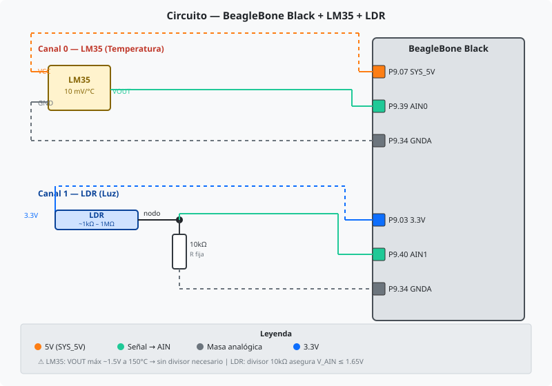
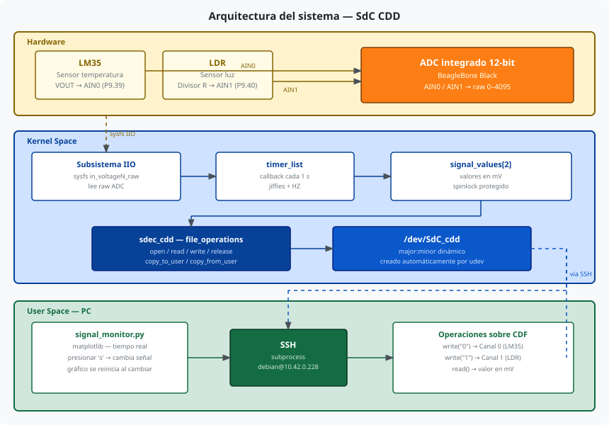
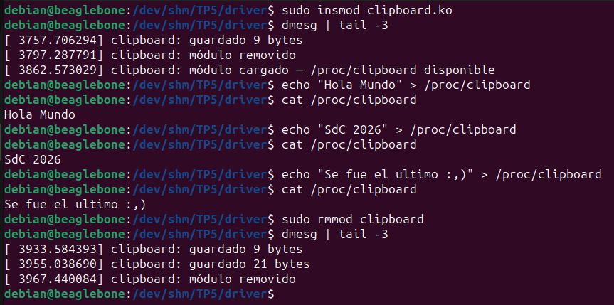
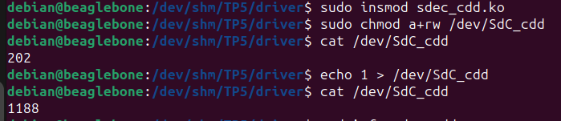
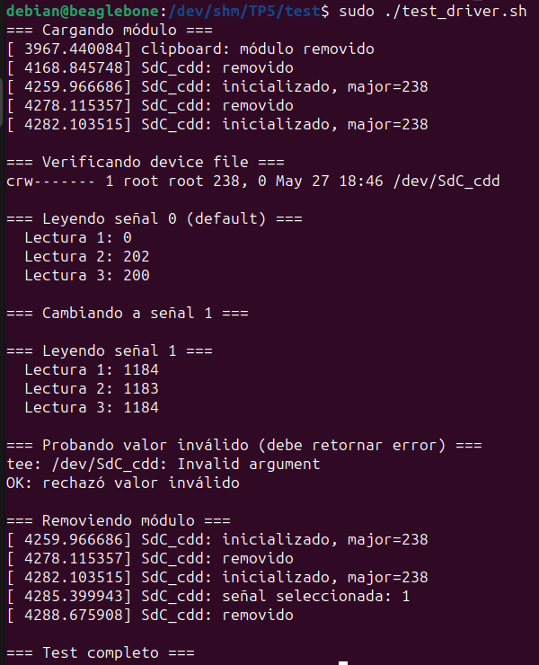
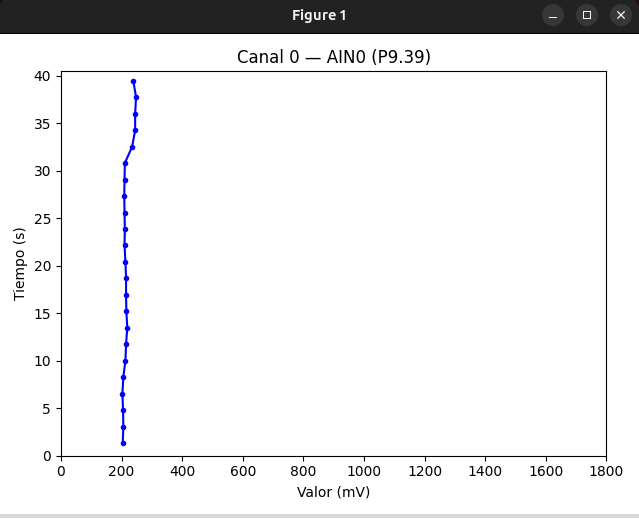
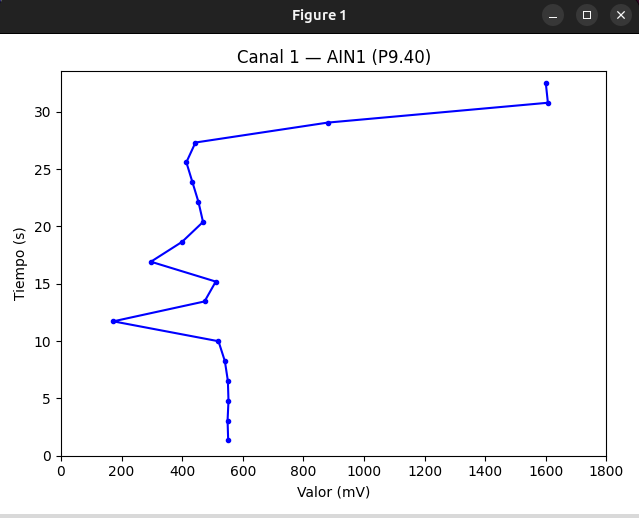
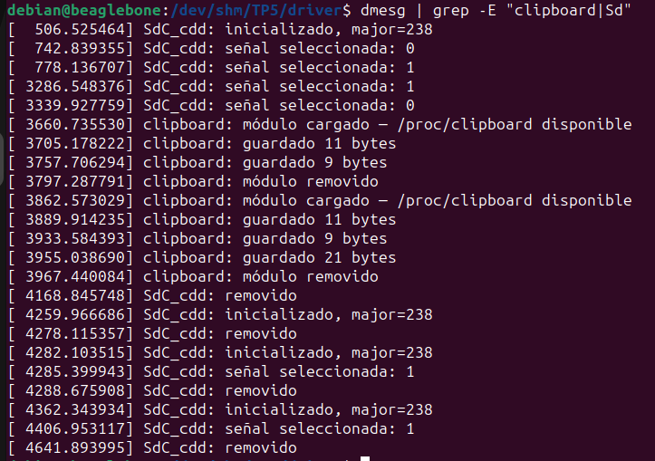

# Device Drivers

**Asignatura:** Sistemas de Computación  

**Profesores:** 
  - Jorge, Javier Alejandro
  - Solinas, Miguel Angel

**Estudiantes:** 
  - Costamagna, Matias
  - Davila Tomassi, Carlos Valentino
  - Sabena, Maria Pilar

**Link del repositorio:** https://github.com/Mati-Costamagna/sudo-apruebenos/tree/TP5

**Fecha:** Junio 2026

---

## Introducción

Un "driver" es aquel que conduce, administra y controla la entidad bajo su mando. En el contexto del software de sistemas, un **device driver** hace exactamente eso con un dispositivo: proporciona una abstracción del hardware y una interfaz, posiblemente estandarizada, para que el sistema operativo y las aplicaciones de usuario puedan interactuar con él sin conocer los detalles de su funcionamiento interno.

Es importante distinguir tres conceptos:

- **Device driver (software driver):** pieza de software que controla un dispositivo a través del sistema operativo. Es el foco de este trabajo.
- **Device controller:** dispositivo de hardware que gestiona otro dispositivo (ej. un controlador IDE, un controlador USB, un controlador SPI). Es hardware en sí mismo, y generalmente necesita su propio driver (denominado bus driver) para ser gestionado.
- **Bus driver:** driver del bus de comunicación subyacente; es la capa de software más baja del sistema operativo, sobre la cual se construyen los device drivers específicos.

En Linux, los device drivers se clasifican en tres grandes verticales según la naturaleza de su interfaz:

| Vertical | Orientación | Ejemplos |
|---|---|---|
| **Character (CDD)** | Byte a byte, secuencial | Puertos serie, audio, cámaras, GPIO |
| **Block** | Por bloques, acceso aleatorio | Discos, SSDs, particiones |
| **Network** | Por paquetes | Tarjetas de red, Wi-Fi |

El grupo mayoritario de drivers pertenece al vertical **Character**. Todo driver de dispositivo que no sea de almacenamiento ni de red es, en alguna forma, un Character Device Driver (CDD). La interfaz entre el espacio de usuario y el CDD se materializa a través de un **Character Device File (CDF)** en el directorio `/dev`: una aplicación abre ese archivo y realiza operaciones estándar (`open`, `read`, `write`, `close`, `ioctl`) que el Virtual File System (VFS) del kernel redirige a las funciones registradas por el driver.

El vínculo entre el CDF y el CDD no se basa en el nombre del archivo sino en un par de números (major:minor) que el kernel usa como índice. El número mayor identifica al driver responsable; el número menor distingue instancias dentro del mismo driver.

En este trabajo se construye un CDD desde cero, se lo conecta con una aplicación de espacio de usuario, y se estudia el flujo completo de datos entre hardware (real o simulado), kernel y userspace.

## Objetivos del trabajo

Este trabajo práctico cubre los siguientes temas:

- **Arquitectura de un CDD:** estructura de `file_operations`, registro de major/minor, creación automática del device node vía udev.
- **Ciclo de vida del driver:** `module_init()` / `module_exit()`, `alloc_chrdev_region()`, `class_create()`, `device_create()` y sus contrapartes de cleanup.
- **Transferencia de datos kernel ↔ userspace:** uso correcto de `copy_to_user()` y `copy_from_user()`; por qué no se puede usar `memcpy` directamente.
- **Timers en el kernel:** uso de `timer_list` para ejecutar código periódico en espacio de kernel (muestreo de señales a 1 Hz).
- **Sincronización en kernel:** protección de datos compartidos entre el timer callback y las `file_operations` mediante `spinlock`.
- **Subsistema IIO:** lectura del ADC integrado de la BeagleBone Black mediante los archivos sysfs expuestos por el subsistema IIO (`/sys/bus/iio/devices/iio:device0/in_voltageX_raw`), usando `filp_open` + `kernel_read` desde el módulo. La API formal `iio_channel_get()` requiere un `platform_device` y entradas en el Device Tree; al tratarse de un módulo standalone sin nodo DT propio, se accede a sysfs directamente.
- **procfs:** creación de entradas en `/proc` con `proc_ops` (API recomendada desde kernel 5.6, que reemplaza a `file_operations` para evitar overhead de campos que no aplican en procfs).
- **Aplicación de usuario:** lectura de un CDF, selección de señal vía `write()`, graficación en tiempo real con ejes correctamente etiquetados y reset al cambiar de señal.

## Hardware

La implementación se ejecuta sobre una **BeagleBone Black (BBB)** con su ADC integrado de 12 bits (7 canales, máx 1.8V por pin AIN).

### Lista de materiales

| Componente | Cantidad | Función |
|---|---|---|
| BeagleBone Black | 1 | Placa principal (CPU ARM + ADC integrado) |
| Cable mini-USB o Ethernet | 1 | Conexión SSH desde la PC |
| Sensor LM35 | 1 | Sensor de temperatura analógico (Canal 0) |
| LDR | 1 | Sensor de luz (Canal 1) |
| Resistor 10kΩ | 1 | Divisor resistivo para LDR |
| Breadboard + jumpers | — | Conexiones |



## Werner Almesberger

Werner Almesberger es un ingeniero de software suizo conocido por sus contribuciones al kernel de Linux, en particular por ser el autor original del soporte para el sistema de archivos **FAT/VFAT** en Linux (módulo `fs/fat`). Su nombre aparece en los comentarios de ese subsistema del kernel. También trabajó en el proyecto LILO (Linux Loader) y fue uno de los primeros contribuidores del kernel en los años 90.

```bash
# Su nombre puede encontrarse en:
ls /lib/modules/$(uname -r)/kernel/fs/fat/
modinfo fat | grep author
```

## Implementación del driver

### Arquitectura general

El driver `sdec_cdd` implementa el vertical **Character Device Driver** de Linux.



### Lectura del ADC

El driver utiliza el subsistema **IIO (Industrial I/O)** de Linux, que expone los canales ADC como archivos en sysfs:

```
/sys/bus/iio/devices/iio:device0/in_voltage0_raw  → AIN0 (0–4095)
/sys/bus/iio/devices/iio:device0/in_voltage1_raw  → AIN1 (0–4095)
```

El valor raw se convierte a mV: `mV = raw × 1800 / 4095`.

### Timer de muestreo

Un `timer_list` del kernel dispara cada segundo (`jiffies + HZ`), lee ambos canales ADC y actualiza el array `signal_values[]` protegido por un `spinlock`.

### Interfaz con userspace

| Operación | Comportamiento |
|---|---|
| `read()` | Retorna el valor en mV de la señal seleccionada como string ASCII |
| `write("0")` | Selecciona Canal 0 (AIN0) |
| `write("1")` | Selecciona Canal 1 (AIN1) |
| `write(otro)` | Retorna `EINVAL` |

El par **major:minor** se asigna dinámicamente con `alloc_chrdev_region()`. udev crea automáticamente `/dev/SdC_cdd` al cargar el módulo.

## Módulo /proc — clipboard

La consigna también pide implementar un módulo que use el sistema de archivos `/proc` en lugar del vertical Character Device. Este ejemplo ilustra la diferencia entre ambos enfoques.

### Diferencias clave: CDD vs procfs

| Aspecto | CDD (`sdec_cdd`) | procfs (`clipboard`) |
|---|---|---|
| Nodo | `/dev/SdC_cdd` | `/proc/clipboard` |
| API de operaciones | `struct file_operations` | `struct proc_ops` |
| Registro | `alloc_chrdev_region` + `cdev_add` | `proc_create` |
| Propósito típico | Dispositivos hardware | Información/configuración del kernel |
| Major:minor | Sí (asignado por kernel) | No aplica |

Desde kernel 5.6, las entradas `/proc` deben usar `proc_ops` en lugar de `file_operations`. Esto evita que el VFS aplique optimizaciones (como `llseek`) que no tienen sentido en archivos virtuales de procfs.

### Uso

```bash
# Cargar el módulo:
sudo insmod clipboard.ko

# Escribir en el portapapeles:
echo "Hola mundo..." > /proc/clipboard

# Leer el portapapeles:
cat /proc/clipboard
# Salida: Hola mundo...

# Remover el módulo:
sudo rmmod clipboard
```



## Herramientas y entorno

### En la BeagleBone Black

```bash
# Dependencias para compilar el módulo:
sudo apt install build-essential linux-headers-$(uname -r)

# Verificar ADC disponible:
cat /sys/bus/iio/devices/iio:device0/in_voltage0_raw
```

### En la PC (para la aplicación gráfica)

La app Python corre en la PC y lee los datos de la BBB por SSH, evitando instalar dependencias gráficas en la placa:

```bash
cd app/
python3 -m venv venv
source venv/bin/activate
pip install matplotlib
```

## Conexión headless con la BeagleBone Black

### Hardware requerido

| Elemento | Uso |
|---|---|
| Cable Micro-USB | Alimentación 5V de la BBB |
| Cable Ethernet (Cat5e+) | Conexión directa PC ↔ BBB |
| PC Linux con puerto Ethernet físico | Host de desarrollo |

### Paso 1 — Conexión física y verificación de arranque

Conectar el Micro-USB para energizar la BBB. Verificar que el LED de Power permanezca fijo y los 4 LEDs azules de estado comiencen a parpadear, indicando que el kernel interno inició correctamente. Luego conectar el cable Ethernet directo entre la BBB y la PC.

### Paso 2 — Identificar la interfaz Ethernet en la PC

```bash
dmesg | grep -iE 'eth|enp|net' | tail -n 10
```

El sistema asigna un nombre lógico a la interfaz (ej. `enp1s0`). Confirmar con el mensaje `enp1s0: Link is Up`.

### Paso 3 — Configurar la PC como servidor DHCP (compartir conexión)

La BBB no tiene IP estática en su puerto Ethernet; necesita que un router le asigne una dirección. Se configura la PC como servidor DHCP temporal con NetworkManager:

```bash
# Crear perfil de red con modo compartido
sudo nmcli con add type ethernet ifname enp1s0 con-name BeagleEthernet ipv4.method shared

# Activar la configuración
sudo nmcli con up BeagleEthernet
```

El modo `shared` asigna automáticamente un rango de IPs privadas `10.42.0.X` al dispositivo conectado.

### Paso 4 — Descubrir la IP asignada a la BBB

Esperar ~15 segundos para que la placa negocie su dirección y luego leer la tabla ARP:

```bash
arp -an | grep enp1s0
# Alternativa:
ip r | grep enp1s0
```

### Paso 5 — Conectarse por SSH

```bash
ssh debian@10.42.0.X   # reemplazar X por el número asignado
# usuario: debian
# contraseña: temppwd
```

---

## Compilación y uso

### 1. Transferir el proyecto a la BBB

```bash
# Desde la PC:
ssh debian@10.42.0.228 "mkdir -p ~/TP5"
scp -r driver app test debian@10.42.0.228:~/TP5/
```

### 2. Compilar el módulo en la BBB

```bash
# En la BBB:
cd ~/TP5/driver
make
```

### 3. Cargar el módulo

```bash
sudo insmod sdec_cdd.ko
dmesg | tail -5          # debe mostrar major asignado y "inicializado"
ls -l /dev/SdC_cdd       # char device c <major> 0
```

Una vez cargado, se puede verificar la lectura y el cambio de señal directamente desde la terminal:



El driver responde con el valor en mV de la señal seleccionada: `cat /dev/SdC_cdd` devuelve el canal activo y `echo 1 > /dev/SdC_cdd` conmuta al canal 1.

### 4. Probar con el script de prueba

```bash
cd ~/TP5/test
sudo bash test_driver.sh
```



El script carga el módulo, verifica que el device file fue creado como `crw` con major 238, lee tres veces cada señal, prueba que un valor inválido retorna `EINVAL` y finalmente descarga el módulo.

### 5. Correr la aplicación gráfica (desde la PC)

```bash
# Configurar SSH sin contraseña (una sola vez):
ssh-copy-id debian@10.42.0.228

# Ejecutar:
cd app/
source venv/bin/activate
python3 signal_monitor.py --signal 0
```

Presioná **`s`** para cambiar de señal. El gráfico se reinicia automáticamente.

**Canal 0 — AIN0 (LM35, temperatura):** señal estable alrededor de ~220 mV a temperatura ambiente.



**Canal 1 — AIN1 (LDR, luz):** señal variable según la iluminación del ambiente.



### 6. Remover el módulo

```bash
# En la BBB:
sudo rmmod sdec_cdd
dmesg | tail -3
```

El módulo se compila directamente en la BBB sin necesidad de cross-compilación. Las dos señales provienen de los pines AIN0 y AIN1 del ADC integrado, leídas a través del subsistema IIO del kernel.

Los logs del kernel muestran el ciclo completo de ambos módulos (`sdec_cdd` y `clipboard`): inicialización con major asignado, cambios de señal seleccionada y descarga limpia.



---

## Desarrollo y problemas encontrados

### 1. Sistema de archivos raíz lleno

Al intentar transferir los archivos a la BBB, el sistema de archivos raíz (`/`) estaba completamente lleno. El directorio `/var/log` ocupaba **287MB** de logs acumulados.

**Solución:**
```bash
sudo journalctl --vacuum-size=10M
sudo find /var/log -type f -name '*.log' -delete
sudo find /var/log -type f -name '*.gz' -delete
```

Dado que el espacio en `/` seguía siendo limitado, el proyecto se alojó en `/dev/shm` (tmpfs en RAM, 244MB disponibles). **Nota:** este directorio se borra al reiniciar la placa.

---

### 2. La aplicación gráfica no corre en la BBB

La BBB es un sistema embebido que corre sin entorno gráfico (headless). Al intentar ejecutar `signal_monitor.py` en la placa, matplotlib no puede abrir una ventana porque no hay servidor X11/Wayland disponible.

**Solución:** ejecutar la aplicación en la PC del desarrollador. La app lee los datos del driver en la BBB mediante SSH, usando `subprocess` con `BatchMode=yes`. La placa actúa como servidor de datos y la PC como cliente de visualización.

---

### 3. Escritura al device requería sudo

La función `select_signal()` necesita escribir en `/dev/SdC_cdd`. Desde un proceso SSH sin TTY interactivo, `sudo` no puede pedir contraseña y falla silenciosamente.

**Solución:** cambiar los permisos del device tras cargarlo:
```bash
sudo chmod a+rw /dev/SdC_cdd
```

---

### 4. Backend gráfico de matplotlib no disponible

Al correr la app en la PC, matplotlib lanzaba el error `Animation was deleted without rendering anything` porque el backend por defecto no encontraba un display.

**Solución:** forzar el backend TkAgg al inicio del script:
```python
import matplotlib
matplotlib.use("TkAgg")
```

---

### 5. Archivos perdidos tras reinicio de la BBB

Al reiniciarse la BBB (por cuelgue o desconexión), los archivos en `/dev/shm` se borran porque es un sistema de archivos en RAM.

**Solución:** ante cada reinicio, retransferir y recompilar el módulo:
```bash
ssh debian@10.42.0.228 "mkdir -p /dev/shm/TP5"
scp -r driver test debian@10.42.0.228:/dev/shm/TP5/
ssh debian@10.42.0.228 "cd /dev/shm/TP5/driver && make && sudo insmod sdec_cdd.ko && sudo chmod a+rw /dev/SdC_cdd"
```

---

### 6. LM35 alimentado a 3.3V no funciona

El LM35 requiere un mínimo de tensión de alimentación para operar correctamente. Alimentado desde P9.03 (3.3V) su salida caía a 0V.

**Solución:** alimentar desde **P9.07 (SYS_5V)** que provee 5V estables desde la fuente del sistema. La salida del LM35 a temperatura ambiente (~250mV) está muy por debajo del límite de 1.8V del AIN, por lo que no se necesita divisor resistivo.