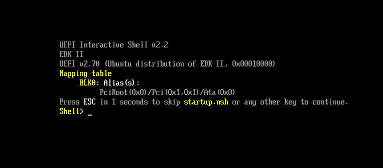
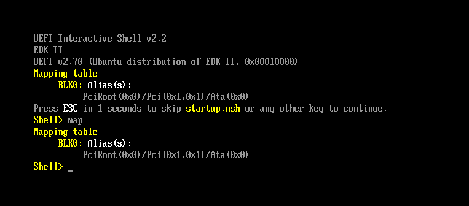
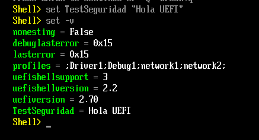
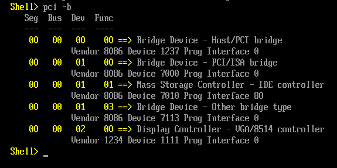
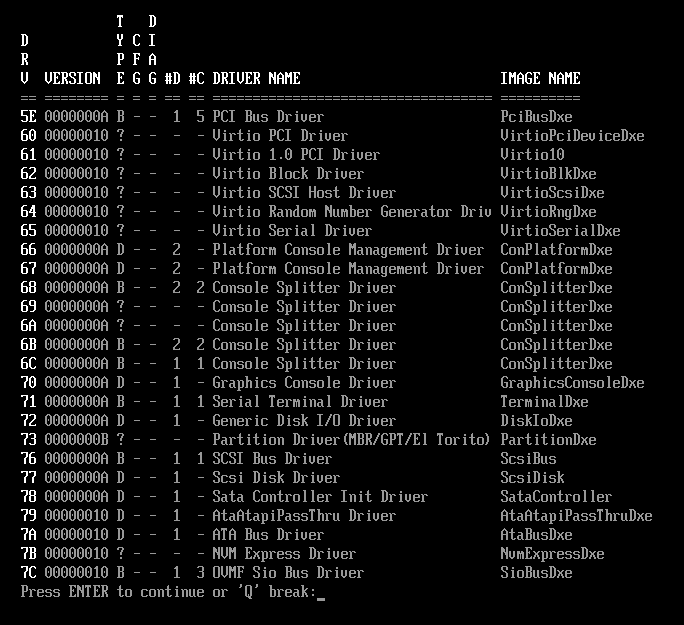

# TP1 — Exploración del entorno UEFI y la Shell

**Objetivo:** Explorar cómo UEFI abstrae el hardware y gestiona la configuración antes de la carga del sistema operativo.


## 1.1 Arranque en el entorno virtual

A diferencia del BIOS Legacy que simplemente leía el primer sector de un disco (MBR) y saltaba a la dirección física fija `0x7C00`, UEFI es un entorno completo con su propio gestor de memoria, red, consola y sistema de archivos. Para explorarlo usamos **QEMU** como emulador de hardware y **OVMF** como firmware UEFI.

### Comando de arranque

```bash
qemu-system-x86_64 -m 512 -bios /usr/share/ovmf/OVMF.fd -net none
```

| Opción | Significado |
|--------|-------------|
| `-m 512` | 512 MB de RAM para la máquina virtual |
| `-bios /usr/share/ovmf/OVMF.fd` | Usa OVMF como firmware UEFI en lugar del BIOS por defecto |
| `-net none` | Sin red, para simplificar el arranque |

Al arrancar aparece directamente la **UEFI Interactive Shell v2.2**, el entorno de línea de comandos del firmware. Esto ya muestra una diferencia fundamental con el BIOS Legacy: UEFI tiene una shell interactiva integrada, mientras que el BIOS simplemente ejecutaba el código del MBR sin ninguna interfaz.



La pantalla de arranque muestra:
- **UEFI Interactive Shell v2.2** — versión de la shell
- **EDK II** — la implementación de UEFI (TianoCore, la referencia de la industria)
- **UEFI v2.70** — versión del estándar UEFI
- **Mapping table** — los dispositivos detectados automáticamente

---

## 1.2 Exploración de Dispositivos — Handles y Protocolos

### Comando `map`

```
Shell> map
```



El comando `map` muestra la **tabla de mapeo** de dispositivos del firmware. En nuestro caso:

```
BLK0: Alias(s):
      PciRoot(0x0)/Pci(0x1,0x1)/Ata(0x0)
```

**`BLK0`** es el único dispositivo de bloque detectado — el disco virtual de QEMU. La ruta `PciRoot(0x0)/Pci(0x1,0x1)/Ata(0x0)` describe la ubicación exacta del dispositivo en el árbol de hardware:

- `PciRoot(0x0)` → bus PCI raíz
- `Pci(0x1,0x1)` → controlador en slot 1, función 1
- `Ata(0x0)` → disco ATA número 0

No aparece `FS0:` porque el disco no tiene un sistema de archivos FAT32 que UEFI pueda montar — solo ve el bloque crudo.

### Comando `dh -b`

```
Shell> dh -b
```


El comando `dh` (Device Handle dump) muestra la **base de datos de Handles y Protocolos** de UEFI. Cada Handle es un identificador de entidad (física o lógica) y cada Protocolo es una interfaz de software instalada sobre ese Handle.

Algunos Handles destacados:

| Handle | Protocolo | Significado |
|--------|-----------|-------------|
| `01` | `LoadedImage(DxeCore)` | El núcleo de la fase DXE cargado en memoria |
| `0D` | `RuntimeArch` | Servicios que sobreviven después de que el OS toma el control |
| `0F` | `SecurityArch` | Módulo de seguridad del firmware |
| `11` | `DebugSupport` | Soporte de debugging a nivel de firmware |
| `16` | `CpuArch` | Abstracción de la CPU |

### Pregunta de Razonamiento 1

> **Al ejecutar `map` y `dh`, vemos protocolos e identificadores en lugar de puertos de hardware fijos. ¿Cuál es la ventaja de seguridad y compatibilidad de este modelo frente al antiguo BIOS?**

**Respuesta:**

El BIOS Legacy accedía al hardware mediante **interrupciones fijas** (INT 10h para video, INT 13h para disco, etc.) y asumía direcciones de I/O específicas del hardware. Esto creaba dos problemas graves:

1. **Compatibilidad:** el código debía conocer el hardware exacto. Un driver para una placa de red específica no funcionaba en otra sin modificaciones.

2. **Seguridad:** las interrupciones del BIOS podían ser interceptadas fácilmente por malware (técnica de "hooking de interrupciones"), ya que no había verificación de quién instalaba el handler.

El modelo UEFI de **Handles y Protocolos** resuelve ambos problemas:

- **Compatibilidad:** los drivers instalan Protocolos identificados por GUIDs. Cualquier aplicación que necesite acceso a disco usa el protocolo `SimpleFileSystem` sin importar qué hardware físico hay debajo — el driver correcto para ese hardware ya está instalado. Si mañana cambia el hardware, solo cambia el driver, no las aplicaciones.

- **Seguridad:** los Protocolos se instalan a través de Boot Services con mecanismos de validación. No cualquier código puede reemplazar un protocolo arbitrariamente. Además, Secure Boot verifica la firma criptográfica de los drivers antes de cargarlos, garantizando que solo código autorizado puede instalar protocolos en el sistema.

---

## 1.3 Análisis de Variables Globales — NVRAM

### Comando `dmpstore -b`

```
Shell> dmpstore -b
```


El comando `dmpstore` (Dump Store) muestra todas las **variables no volátiles** almacenadas en la NVRAM del firmware. Estas variables persisten aunque se apague la computadora.

Las variables más importantes observadas:

| Variable | Atributos | Significado |
|----------|-----------|-------------|
| `BootOrder` | `NV+RT+BS` | Define el orden en que el Boot Manager prueba los dispositivos de arranque |
| `Boot0001` | `NV+RT+BS` | Descripción del primer dispositivo: la UEFI Shell interna |
| `SecureBoot` | `RT+BS` | Estado de Secure Boot (`0x00` = desactivado) |
| `LangCodes` | `RT+BS` | Idiomas soportados por el firmware |
| `ConIn` / `ConOut` | `NV+RT+BS` | Dispositivos de consola de entrada y salida |

Los atributos significan:
- **`NV`** → Non-Volatile: persiste en NVRAM al apagar
- **`RT`** → Runtime: disponible después de que el OS toma el control
- **`BS`** → Boot Services: disponible durante el arranque

La variable `BootOrder` contiene `00 00 01 00`, lo que significa que el Boot Manager primero intenta arrancar `Boot0000` y luego `Boot0001`. Al decodificar el contenido de `Boot0001` en Unicode se lee `"EFI Internal Shell"`.

### Crear y verificar una variable de sesión

```
Shell> set TestSeguridad "Hola UEFI"
Shell> set -v
```



El comando `set -v` muestra todas las variables de entorno de la shell actual. La variable `TestSeguridad = Hola UEFI` aparece correctamente.

Variables de entorno notables:

| Variable | Valor | Significado |
|----------|-------|-------------|
| `uefiversion` | `2.70` | Versión del firmware UEFI |
| `uefishellversion` | `2.2` | Versión de la shell interactiva |
| `profiles` | `Driver1;Debug1;network1;network2` | Perfiles activos de la shell |
| `lasterror` | `0x15` | Último código de error |
| `TestSeguridad` | `Hola UEFI` | Variable creada por nosotros |

**Diferencia importante:** `dmpstore` muestra variables **persistentes en NVRAM** (sobreviven al apagado), mientras que `set -v` muestra variables **de sesión de la shell** (se pierden al cerrar la shell).

### Pregunta de Razonamiento 2

> **Observando las variables `Boot####` y `BootOrder`, ¿cómo determina el Boot Manager la secuencia de arranque?**

**Respuesta:**

El Boot Manager de UEFI sigue un proceso determinístico basado en variables de NVRAM:

1. **Lee `BootOrder`:** esta variable contiene una lista ordenada de números de 16 bits (ej: `0000`, `0001`, `0002`...) que identifican entradas de arranque.

2. **Itera en orden:** para cada número en `BootOrder`, busca la variable `Boot####` correspondiente (ej: `Boot0000`, `Boot0001`).

3. **Parsea cada entrada `Boot####`:** cada variable contiene:
   - Un atributo de activación (si está activa o no)
   - Una descripción en Unicode (ej: `"EFI Internal Shell"`)
   - Una **Device Path** que describe exactamente dónde está el binario a cargar (bus PCI, disco, partición, ruta del archivo)

4. **Intenta cargar:** llama a `LoadImage()` con la Device Path. Si tiene éxito, llama a `StartImage()` para ejecutarlo.

5. **Continúa en caso de fallo:** si `LoadImage()` falla (el dispositivo no existe o el archivo no se encuentra), pasa a la siguiente entrada en `BootOrder`.

En nuestro caso, `BootOrder = 00 00 01 00` indica que primero se intenta `Boot0000` y luego `Boot0001` (la shell). Como no hay ningún OS instalado, llega hasta la shell.

Este mecanismo es completamente configurable desde el firmware o desde el OS (en Linux con `efibootmgr`, en Windows desde la configuración del sistema), lo que lo hace mucho más flexible que el BIOS Legacy donde el orden de arranque era una configuración rudimentaria de 4-5 opciones fijas.

---

## 1.4 Footprinting de Memoria y Hardware

### Comando `memmap -b`

```
Shell> memmap -b
```


El comando `memmap` muestra el **mapa completo de la memoria física** de la plataforma. Cada región tiene un tipo que indica su uso y quién puede accederla.

Tipos de regiones observados:

| Tipo | Significado | ¿Disponible para el OS? |
|------|-------------|------------------------|
| `Available` | Memoria libre | Sí, el OS puede usarla |
| `BS_Code` | Código de Boot Services | No, se libera con `ExitBootServices()` |
| `BS_Data` | Datos de Boot Services | No, se libera con `ExitBootServices()` |
| `RT_Code` | Código de Runtime Services | **Sí, pero mapeada y bloqueada** |
| `RT_Data` | Datos de Runtime Services | **Sí, pero mapeada y bloqueada** |
| `ACPI_NVS` | Reservada para ACPI | No, gestionada por firmware |
| `Reserved` | Reservada por el hardware | No |

**Resumen de memoria en nuestra VM:**

| Región | Páginas | Bytes |
|--------|---------|-------|
| `BS_Code` | 990 | ~4 MB |
| `BS_Data` | 8,301 | ~34 MB |
| `RT_Code` | 256 | ~1 MB |
| `RT_Data` | 481 | ~2 MB |
| `Available` | 120,074 | ~491 MB |
| **Total** | — | **511 MB** |

### Comandos `pci -b` y `drivers -b`

```
Shell> pci -b
```



El comando `pci` lista todos los dispositivos PCI detectados por el firmware:

| Bus | Dev | Func | Descripción |
|-----|-----|------|-------------|
| 00 | 00 | 00 | Bridge Device — Host/PCI bridge |
| 00 | 00 | 00 | Bridge Device — PCI/ISA bridge |
| 00 | 01 | 01 | Mass Storage Controller — IDE controller |
| 00 | 01 | 03 | Bridge Device — Other bridge type |
| 00 | 02 | 00 | Display Controller — VGA/8514 controller |

```
Shell> drivers -b
```


El comando `drivers` muestra todos los drivers que la fase DXE cargó en memoria:

| Driver | Nombre | Rol |
|--------|--------|-----|
| `5E` | `PciBusDxe` | Gestiona el bus PCI |
| `68` | `ConSplitterDxe` | Permite múltiples consolas simultáneas |
| `70` | `GraphicsConsoleDxe` | Consola gráfica |
| `72` | `DiskIoDxe` | I/O de disco |
| `73` | `PartitionDxe` | Detecta particiones MBR/GPT |
| `77` | `ScsiDisk` | Driver de disco SCSI |
| `78` | `SataController` | Controlador SATA |

### Pregunta de Razonamiento 3

> **En el mapa de memoria (`memmap`), existen regiones marcadas como `RuntimeServicesCode`. ¿Por qué estas áreas son un objetivo principal para los desarrolladores de malware (Bootkits)?**

**Respuesta:**

Las regiones `RT_Code` (RuntimeServicesCode) son un objetivo privilegiado por varias razones:

**1. Sobreviven a `ExitBootServices()`**

Cuando el OS llama a `ExitBootServices()`, el firmware libera toda la memoria marcada como `BS_Code` y `BS_Data`. Sin embargo, las regiones `RT_Code` y `RT_Data` **no se liberan** — se mantienen mapeadas en el espacio de direcciones virtual del OS. El OS (Linux, Windows) puede llamar a estas funciones en tiempo de ejecución para operaciones como leer/escribir variables UEFI o ajustar el reloj del sistema.

**2. Operan con los privilegios más altos**

El código en `RT_Code` ejecuta en **Ring 0** (el nivel de privilegio más alto del procesador) y tiene acceso a todo el espacio de memoria. Un atacante que logre modificar código en esta región tiene efectivamente el control total de la plataforma.

**3. Son invisibles para el OS**

El OS no puede inspeccionar ni modificar estas regiones — el hardware las protege mediante el mecanismo de **Memory Attributes** de UEFI. Ningún antivirus que corra dentro del OS puede detectar código malicioso embebido en `RT_Code` porque opera por debajo del OS.

**4. Persisten a través de reinicios**

Si el malware logra modificar el código en el chip de flash NVRAM (donde vive el firmware), la infección sobrevive a cualquier reinstalación del OS. Herramientas como `fwupdate` o vectores de ataque como el **S3 Boot Script** (mencionado en el documento teórico) pueden lograrlo.


**Mitigación:** Secure Boot verifica la firma del firmware al arrancar, y mecanismos como **UEFI Secure Boot + Measured Boot (TPM)** intentan garantizar la integridad de estas regiones. Sin embargo, vulnerabilidades en el firmware mismo (como las que aprovechó LoJax) pueden bypassear estas protecciones.

---

## Resumen de comandos ejecutados

| Comando | Sección del TP | Qué muestra |
|---------|---------------|-------------|
| `map` | 1.2 | Dispositivos de almacenamiento detectados y sus rutas |
| `dh -b` | 1.2 | Base de datos de Handles y Protocolos instalados |
| `dmpstore -b` | 1.3 | Variables persistentes en NVRAM (BootOrder, Boot####, etc.) |
| `set TestSeguridad "Hola UEFI"` | 1.3 | Crear una variable de sesión |
| `set -v` | 1.3 | Listar variables de entorno de la shell |
| `memmap -b` | 1.4 | Mapa completo de memoria física y sus tipos |
| `pci -b` | 1.4 | Dispositivos PCI detectados |
| `drivers -b` | 1.4 | Drivers cargados por la fase DXE |

