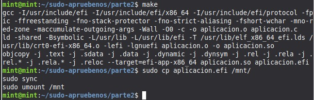

[README.md](https://github.com/user-attachments/files/27329693/README.md)
# TP3 - Ejecución en Bare Metal (UEFI)

## Objetivo
El objetivo de esta tercera parte es preparar un medio de arranque USB con una aplicación UEFI propia, bootear una computadora real (o emulada) y ejecutar el binario directamente sobre el hardware, sin sistema operativo intermedio. En este caso utilizaremos una Notebook HP, con un firmware UEFI.

## Requisitos
- PC con firmware UEFI (se deshabilita Secure Boot)
- Pendrive (mínimo 64 MB, formateado en FAT32)
- Linux (para preparar el USB)
- Aplicación UEFI compilada (`aplicacion.efi`)

## 1. Preparación del Pendrive

### 1.1 Formatear en FAT32
Para cumplir con el requerimiento de la UEFI, se formatea en FAT32, montamos el pendrive y creamos la estructura estandarizada de directorios, dentro del cual se encuentra la  UEFI Shell oficial de TianoCore : https://github.com/tianocore/edk2/raw/UDK2018/ShellBinPkg/UefiShell/X64/Shell.efi -O /mnt/EFI/BOOT/BOOTX64.EFI

### 1.2 Compilación de la aplicación 
Clonamos el repositorio, en cuya parte 2 encontramos "aplicacion.c" y el Makefile, el cual utilizopara convertir "aplicacion" de ".c" a ".efi", resumiendo los pasos intermedios antes desarrollados en la parte 2.

Una vez incluido dentro de la carpeta del pendrive, este está listo para ejecutarse Bare Metal (con la configuracion de Boot adecuada).

### 1.3 Navegación en la Shell UEFI
Tras reiniciar el ordenador de prueba y abrir las configuraciones de boot, desactivamos Secure Boot. Tras desactivar el Secure Boot de esta Notebook HP, pudimos bootear desde el dispositivo USB. Al ingresar en la Shell, podemos ver varias carpetas como FS0:, FS1:, BLK0:, BLK2: que son las distintas carpetas del USB, dentro de FS0: hacemos "ls" y vemos aplicacion.efi.

Al ejecutar la aplicación, tanto en mi PC de escritorio como la HP que se ve en la fotografía, se congeló la pantalla y hubo que reiniciar. Así mismo, intentando compilar en qemu este mismo archivo .efi, se obtuvo el mismo resultado. 
